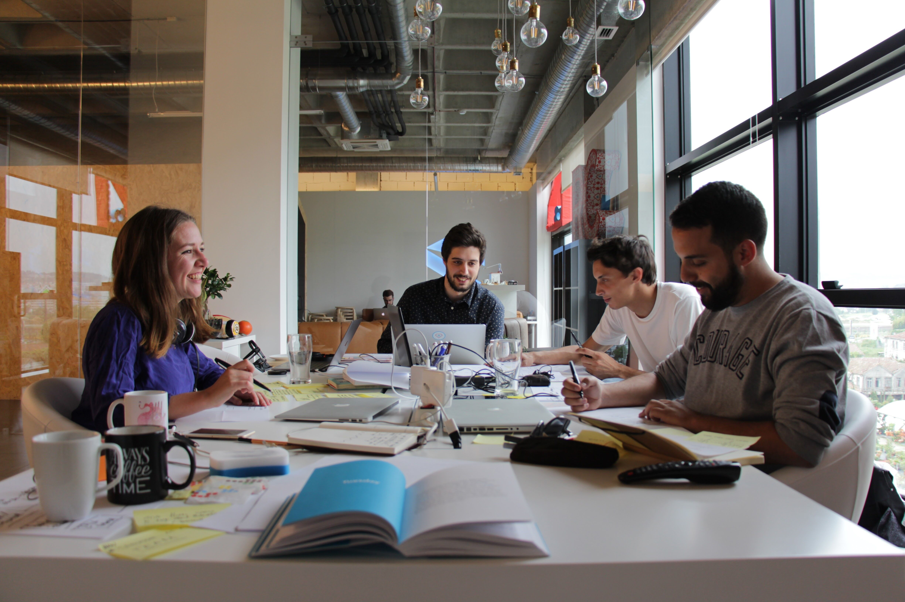

At Subvisual, we never assume we know everything. We know there's something new
to learn every day. We also know that one of the best ways to learn is to put
your hands on and share. That's why we focus on training and continuous
learning opportunities.

In 2020 we want to keep crafting our training opportunities.

If you want to pursue a career in technology and product, we have two programs
in store for you! Our Apprentice and Summer Camp program.

In these programs, you'll work in a creative environment with a mentor.

### What's a mentor?

A mentor is a member of our team. They will help you define goals, give your
guidance, and answer all your questions.

And we have big news! This year our friends at [Aurora], [Finiam], and [Onda]
will join our team of mentors. \o/

## More about the programs

> They never offered me ready-made solutions, they showed me how to get there
> on my own, thinking about the problem from the ground up.
>
> Francisco Baila, Designer

Both programs are a 10-week period of full-time work.

### Apprenticeship program

As an apprentice, you'll work on real projects with real impact, access to
online courses, and create challenges according to your goals. Your mentor will
be with you throughout the program.

Every 2 or 3 weeks, you'll move to a different mentor. This rotation will be a
unique development experience for you. It will allow you to work on different
projects, meet our people, and apply what you will learn in different contexts.

### Summer Camp program

The first 5 weeks are like our apprenticeship program. You'll also have a
mentor to guide you through your experience.

During the last 5 weeks, with the help of your mentors, all Summer Campers will
form a team and build a product together to solve a problem of your choice. The
purpose is not to create a product ready to be launched but to give you a taste
of what it is like to work on a team and build a product from scratch.

**👉One small note:** as the name implies, our Summer Camp program will happen
during the summer. If you're studying, this may be the perfect opportunity for
a season full of adventures, new learnings and fun.

## Who is it for?

Students, recent graduates and experienced professionals are welcome to apply
to our programs.

We have openings in:

- Programming
- Design
- Product Management
- Operations
- Marketing

And, regardless of your field of interest, we're looking for independent and
self-driven people. If you're a curious mind, eager to experience new things
and learn a little bit more every day, Subvisual is the place for you.

Teamwork and a user-centered approach are at our core. That's why we value
people who are, empathetic, humble, and good communicators.

## How to apply

We've kept the application process simple so you can tell us about yourself the
way you want.

Just send us an email at [aloha@subvisual.academy] with the answers to these 3
questions:

- What accomplishments/projects are you most proud of? Provide links if you
  can.
- How do you want to grow?
- Why do you think the apprenticeship/summer camp is right for you?

Don't forget to tell us for which program you're applying to. You can add a
resume/portfolio if you want.

We're flexible on the starting and ending dates.

Applications for an Apprenticeship are open throughout the year. For our Summer
Camp, you should apply until the end of May.

## Benefits

- Weekly allowance depending on where you live
- Free access to our office in Braga
- Free weekly physiotherapy session
- Free team lunch every Friday

At the end of the apprenticeship, we may offer you a position at Subvisual or
at one of our partners.

**💪 Join us! We'll love to have you!**

Hope to hear from you!

[Aurora]: https://auroradigital.co/
[Finiam]: https://www.finiam.com/
[Onda]: https://ondastudio.co/
[aloha@subvisual.academy]: mailto:aloha@subvisual.academy
