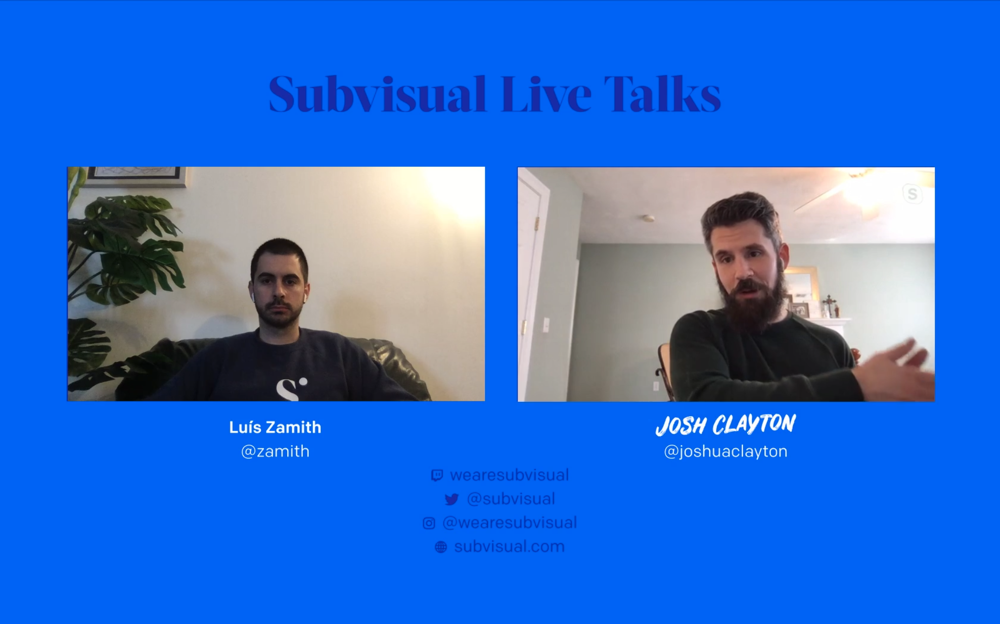

We just had our first [Subvisual Live Talk](https://www.twitch.tv/videos/594487926). Besides our usual [podcast](https://podcast.subvisual.com/), we wanted to try the concept of sharing some of our talks for a while now. Then Zamith took charge. Last Friday we premiered the first edition of a live stream with a very simple concept: **a conversation with interesting guests**. For us, simplicity is key.

The first stream features **an hour of exciting conversation between our own host, [Zamith](https://twitter.com/zamith) and [thoughtbot](https://thoughtbot)'s Boston Managing Director [Josh Clayton](https://twitter.com/joshuaclayton).**

Zamith and Josh dive into the **nature of consulting work, building digital products, the essence of several programming languages, open source and many other topics**. You can ask questions via the chat or by tweeting with the hashtag [#subvisualtalks](https://twitter.com/search?q=%23subvisualtalks&src=typed_query). If you missed it, we made the [full-length VOD of the stream](https://www.twitch.tv/videos/594487926) available for everyone out there.

## What's next

We're aiming to make this a weekly occurence and already have a string of guests lined up. If you have any suggestions, feel free to tweet at us.

That being said, **we're going to be back this Thursday, April 23 at 6 P.M. WEST (GMT+1)** with a very special guest: **[Saša Jurić](https://twitter.com/sasajuric)**, renowed alchemist and author of [Elixir in Action](https://www.manning.com/books/elixir-in-action-second-edition?a_aid=sjuric)!

We're aiming to make this the best possible experience for you, so if you have suggestions, we're only a DM/email away.

Follow us on [Twitter](https://twitter.com/subvisual) and [Twitch](https://twitch.tv/wearesubvisual) to make sure you don't miss the upcoming streams!

---

PS: We're hiring a front-end developer! We're remote friendly, incredibly curious and a lovely bunch! You can find more details on our [hiring blog post](https://subvisual.com/blog/posts/146-subvisual-is-hiring-a-frontend-developer/).
