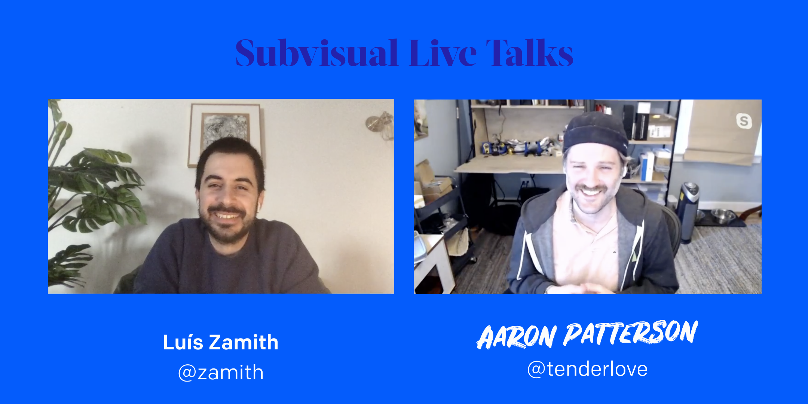
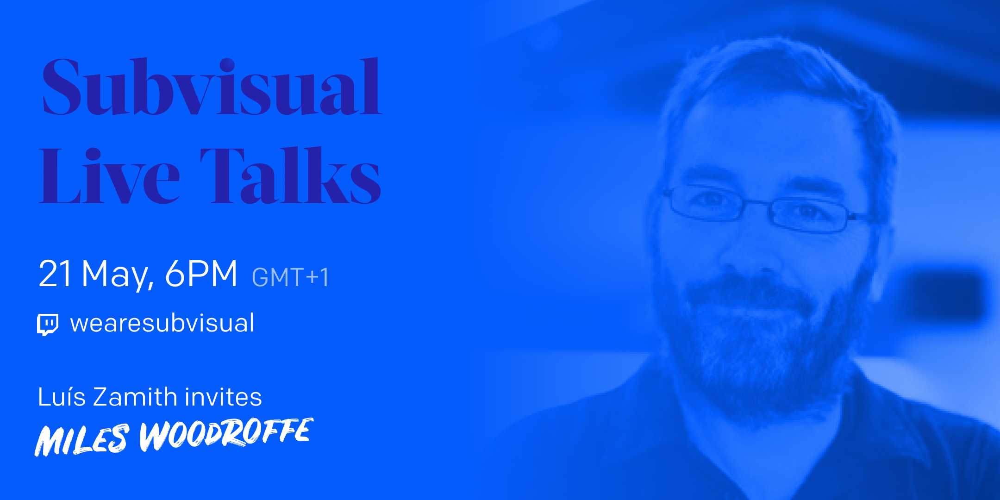

About [a month ago][subvisual-live-talks-announcement] we began our Subvisual
Live Talks. A new and simple concept: **streaming weekly conversations with
interesting guests and friends**. These conversations last for an hour and the
subjects go from [moving from the Marines to product consultancy], [writing an
Elixir book and being part of the Elixir community], [optimizing Ruby's garbage
collector][subvisual-live-talks-tenderlove], to unique moments like [Aaron Patterson making 20 kg of cheese at
home].

We eventually moved everything to YouTube and you can [follow our channel
there][subvisual-youtube], in case you miss the live stream. They're
happening **every Thursday at 6 PM GMT+1**. They've been very organic, we reach
out to potential guests one or two weeks beforehand and just jump on a call
with them. If you have any suggestions for people to invite, please do let us
know on Twitter, at [@subvisual]!

We've been devoting quite some to Ruby. Last week we had [@tenderlove] join us
and talk about Ruby's internals and his open source work.

The video is [already available on YouTube for you to
see][subvisual-live-talks-tenderlove]. As always, Aaron carries a spark of
his own, making it one of the funnest Live Talks we had!

This week we'll be continuing the Ruby trend and hosting **Miles Woodroffe
([@tapster]), CTO at Cookpad** and one of the best people we met at [Ruby Conf
Portugal]!

You can [follow us on Twitch][subvisual-twitch] for the live stream (Thursday,
6PM GMT+1) or [follow us on YouTube][subvisual-youtube] for the VOD which
should be available after a couple of days. You can also **ask questions** on
the Twitch chat or tweet them at us **using [#subvisualtalks]** and we'll do
our best to get our guests to reply!

---

One month in and it's been quite a journey. We've been learning a lot with our
guests, of course, but also some weird directing and streaming tricks.

We're very happy with how things are shaping up, with the simplicity of the
setup and also the incredibly insightful content the conversations carry.
However, we've also reached a point where we want to hear from you. Do you have
any thoughts or suggestions? How are we inspiring you? How could we one up
everything? Let us know over at [@subvisual] and help us make the Live Talks
even better!

[subvisual-live-talks-announcement]: https://subvisual.com/blog/posts/announcing-subvisual-live-talks/
[moving from the Marines to product consultancy]: https://youtu.be/fponvB8i9us
[writing an Elixir book and being part of the Elixir community]: https://youtu.be/4P9WmnUJ2vo
[subvisual-live-talks-tenderlove]: https://youtu.be/ZZ-8O6_nUjE
[Aaron Patterson making 20 kg of cheese at home]: https://youtu.be/ZZ-8O6_nUjE?t=3060
[subvisual-youtube]: https://www.youtube.com/channel/UCs2aM7E1bqul_KZqK0Sq2vg
[@subvisual]: https://twitter.com/subvisual
[@tenderlove]: https://twitter.com/tenderlove
[@tapster]: https://twitter.com/tapster
[Ruby Conf Portugal]: https://rubyconf.pt
[subvisual-twitch]: https://twitch.tv/wearesubvisual
[#subvisualtalks]: https://twitter.com/hashtag/myelixirstatus
