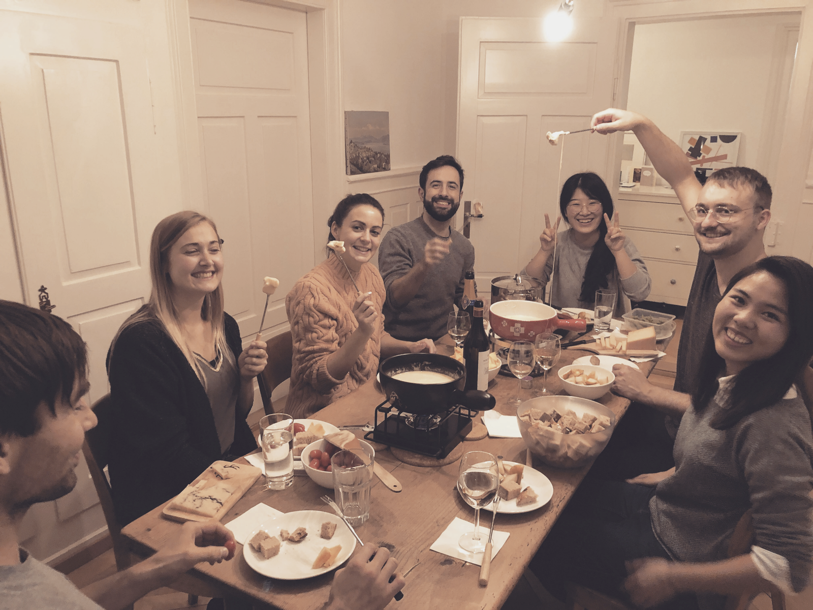

## "The more you know, the more you know you don't know." - Aristotle

When I first started running usability tests and conducting interviews, I didn’t know what the hell I was doing. I had read countless posts and articles, read [Steve Krug](http://sensible.com/)'s books and watched him and other professionals conduct user tests on YouTube, and I finally thought to myself: “Why not?”. Yes, there was a lot of stuff that I needed to learn to do it right, but I knew just enough to start. I was doing all of it for the first time. I made huge, basic, mistakes and felt slightly embarrassed as I played the videos of the interviews. But I got some good insights, I took notice of those mistakes, kept reading, but most importantly, I kept doing it. 

User Experience was an ocean, and I felt as if I was a kid standing excited in the sand, impatient to dive in. Careless to whether I was even able to swim. 

I’d like to say I was always improving, but it didn’t always feel like it. There was a lot of frustration and unexpected setbacks involved. Every time I answered a question, a hundred new ones came to light. This was causing discomfort, but also excitement, propelling me to move forward, to keep trying, keep learning. Eventually, I started to feel a bit more comfortable, a bit more confident in doing it. I found a ‘safe zone’, and was happy to stay there for a while. Unfortunately, we humans don’t do well with ‘being comfortable’ for too long (or at least I don’t), and some other side effects started to kick in - an evergrowing rigidness in the mind, that whispers: “This, I can do well. It’s safe. If I dare step into deeper waters, I might drown.”

I was now spending more time looking at the beach, and less admiring the infinite possibilities hiding underneath the blue horizon. 

I ignored this feeling for a while. I took a deep breath before occasional swims but never made any real progress. There was always this feeling, translated into different variations of the same question: “What if?” 

- What if I can’t swim that far?
- What if the tide is too strong?
- What if I fail?

If you’re thinking this sounds vaguely like impostor syndrome, chances are you are correct. I wasn’t sure I even knew how to be a designer anymore, or if I ever did at all. 

Once I acknowledged this feeling and openly talked about it, I was able to understand it better. This feeling was a consequence, the cause was something else. I’d settled in and become afraid of failing, which led me to replace the “Why not?” with the “What ifs?”, that froze me in my place, never allowing me to dare move forward. 

It became clear that something needed to change. A new challenge, a new scenario, that forced me to venture into deep waters, and unlearn this fear. Preferably, with experts who I could learn from (for the sake of the metaphor, let’s call them scuba-divers). That’s where [Ginetta](https://ginetta.com) comes in.

Ginetta is a digital agency based in Zurich (they’ll open a new office in Porto soon), which puts the user in the heart of the process. They are a big team, with UI, UX, and Research experts, who work mostly for big companies. I was always enticed by the prospect of spending some time working and learning with them, and after a few conversations with [Roberto](https://twitter.com/rmdgb) (CEO at Subvisual) and the rest of the team, as well as with [Simon](https://twitter.com/simonraess) and [Ilona](https://twitter.com/ilonabaier) from Ginetta, we agreed I’d move to Switzerland for 4 months to work in a project, as one of them.

The days and weeks before traveling to Switzerland I was excited, except for the night before actually flying out, where a freezing, familiar feeling started to creep in: “What happens if I fuck this up? Why am I doing this?”. I’d like to say I was able to successfully argue against myself, and completely overcome this there and then. Instead, all I managed to do was change the questions: “What happens if I don’t fuck this up? Why not?”. It wasn’t perfect, but it was just enough to move forward. That’s all it takes.

I arrived in Zurich on Sunday, and Monday I was having lunch on a train heading to Bern, where I’d meet the clients to kickstart the project. I was expected to hit the ground running, and as weird as this might sound, I felt excited rather than scared. If you’d describe this scenario to me a day before, and asked me how I would react, “excited” wouldn’t be the first (or 100th) word to come to mind, believe me. That discrepancy between what I was feeling vs what I expected to feel, was a wake-up call, showing me how wrong I was about myself. 

In the workshop, we attributed a goal for each sprint, and each sprint would take 2 weeks. My job was to prototype a design solution for each of those goals, to have them user tested on Thursday of the second week. That’s it. 

At Subvisual, I was used to wearing lots of hats and welcoming different responsibilities, so it was refreshing to take some weight off and focus on doing one thing, and doing it well. 

Every day during each sprint, I had a scheduled moment on my agenda to show progress and get honest, actionable feedback on it. It kept me on my toes and informed my iterations, fueled my mind. I worked hard all week, every week, and it didn’t “feel” like it. Of course, I felt exhausted, stressed or frustrated every once in a while, there’s no magic bullet for that, but with the help of those closest to me or the project, it never took too long before those repressing emotions would dissolve and transform into new ideas and different ways of looking at the problem. It taught me discipline in a moment where I welcomed it instead of disregarding it. It showed me collaboration was the way to go, but there was still room to grow for me to do it better. 

## "I know now that I know nothing" - Socrates

During the 4 months working at Ginetta, I got to see first-hand how they planned and executed the research strategy. The fundamentals behind it were quite simple, yet crucial to increase the chances of success: Define the goals of your strategy together with the client and the team, make sure everyone’s on board with them and explain your next steps to get the answers. There must be a sense of ownership all across the team, everyone understands what will be done and how they can influence it. In such an environment, ideas tend to grow healthily and mistakes are embraced as part of the learning process. 

The research efforts were lead mostly by two brilliant researchers - [Simi](https://twitter.com/simonefelicitas) and [Myvi](https://www.linkedin.com/in/myvienne/). I probably exhausted them with questions about everything - recruiting process, methods to use, why they wrote X instead of Z… you get the picture. I learned how to better interpret the findings and use them to inform my design decisions, how to digest this information for clients or stakeholders in a way they could understand and care for. I learned new methods, the discipline it takes to make research valuable, and the exhilarating feeling of hitting the nail right in the head. There are no magic tricks when it comes to building something new, you need to face the unknown equipped with your experience, but also the ingenuity to remain curious, flexible, and keep experimenting. Open your work and thoughts to others, trust them, and embrace their feedback as words of encouragement, saying “I know you can do even better. I hope this helps.” Learn your role in your team, and excel at it. Don’t overstep, don’t hide, but most importantly: Don’t ever compare yourself with others. You do you. 

If you’re reading this and feel some of the negative emotions I’ve shared stroke a little bit too close to your heart, I absolutely recommend you to close your eyes, take a deep breath and think: “What scares me the most? What is my biggest challenge?”. Be honest and brave, and you might just find the obstacle you need to face and overcome. Working at Ginetta meant I’d be away from friends and family, integrating a team with people I’ve never worked with before, doing a lot of things for the first time. Going through some painful, personal moments, alone. Meant saying “Why not?” a lot, and showing work in progress to over 30 designers when I wasn’t feeling all that confident. I uncovered significant layers about who I am now, and who I want to be. I feel I’m more prepared as a designer, on the path to become a better person, and grateful to return home stronger than I’d left. 

----------

To all Ginettis who end up reading this. 

You were supportive, caring, and fun as hell. I wish I was better at this and could express how important and beautiful it was to share the office, the jokes, the anguish, the stress, the drinks, and life with you for those 4 months. 

To my dear Flaxies:
I’m eagerly expecting the day we can hug out and go for francesinhas :)
