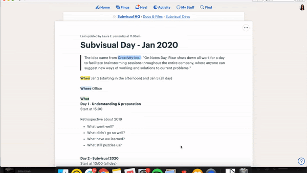

# How we set and track goals

This is the first of a series of blog posts about how we set and track goals at
Subvisual.

We've been experimenting a lot during the last years and we've also tried to
have one year without defining any goals, just going with the flow and taking
all the opportunities that arise.

We ended the year with one big learning: setting goals is important. Not
because last year wasn't a good one (in retrospect, we've had great
achievements and a lot of happy moments), but because without goals we couldn't
have a clear way to measure our progress. We couldn't know if what we're doing
was aligned with our vision, we're just being reactive and got some luck on the
way.

We also learned during that year that goals must be flexible. We enjoyed this
time without goals because we're more aware of the opportunities around us and
that's something we don't want to lose. That's why we not only define yearly
goals and track them, but we also schedule some time to review and adapt them
according to new opportunities.

Goal setting can follow many different processes and, during the past 5 years,
we've been using and adapting a framework called OKRs (Objectives and Key
Results) created by Andy Grove. If you're interested in learning more about
this framework I recommend you to start with ['Measure What Matters' by John
Doerr], I'll share just a part of the book that described the framework in a
really simple way.

> Objectives are the "Whats." They:
> - express goals and intents;
> - are aggressive yet realistic;
> - must be tangible, objective, and unambiguous;
> - should be obvious to a rational observer whether an objective has been
>   achieved;
> - The successful achievement of an objective must provide clear value (...).
>
> Key Results are the "Hows." They:
> - express measurable milestones which, if achieved, will advance objective(s)
>   in a useful manner to their constituents;
> - must describe outcomes, not activities(...);
> - must include evidence of completion. This evidence must be available,
>   credible, and easily discoverable. Examples of evidence include change
>   lists, links to docs, notes, and published metrics reports.
>
> John E. Doerr, in _Measure What Matters_

This blog post will give you an inside glance at our full process and some
extra insights about how we define our goals at the beginning of each year.

## Goal-Setting Process

Our 7-steps process to define and track goals.

### Step 1: Define Yearly Goals

We start every year defining our yearly goals. So the first step is to schedule
a team moment to discuss and define goals. You'll find more info about this
step below.

### Step 2: Share Goals

It's crucial to have goals shared with the team, they must be visible to
everyone in the company and on a tool the team uses daily. At Subvisual, we use
[Basecamp] for internal communication, so we have a [to-do
list][Basecamp-todo-list] with our OKRs where each Key Result is a task.  That
allows us to assign the team member responsible and to have a place to discuss
the next steps and to share progress about each KRs.

### Step 3: Define DRI & Contributors for each KR

Yep, we love acronyms, and here's another one we use: [DRI][DRI] (Directly
Responsible Individual), coined by Apple. This concept about fostering a
culture of clear responsibilities and accountability within our team, and so it
is part of the process.

The third step is to have a DRI for each Key Result; someone who's going to be
the KR's ambassador, guide, and motivate the team to achieve what we've set
for. At the same time, being DRI doesn't mean the team member has to do all the
  tasks by himself/herself.

And since we're a small team and each one of us needs to choose wisely the way
we want to contribute, we also create a small task force for each KR.

### Step 4: Definition of Next steps

For each Key Result we define the next steps, new habits, and whatever we'll
have to do to achieve them. This can happen async (on Basecamp) or with some
work sessions. It depends on the DRI, the task force, and the Key Results'
needs.

### Step 5: Track OKRs

Another learning from our experience: we need a system that ensure we remember
our goals and they are guiding our priorities.

So every month, we have a team moment to share & discuss the progress of our
goals so we're able to make some adjustments if needed.

### Step 6: Review & Adjust OKRs

This step is about keeping our yearly goals flexible. At the end of the first,
second, and third quarter of the year we have a Subvisual Day (usually the last
Friday of the quarter) where we do a retrospective, review our progress, and
redefine our goals.

### Step 7: return to step 2

Unless it's the end of the year, and then we have to return to step 1.

## How we define yearly goals

The first step of the process happens at the beginning of the year, where we
have what we call Subvisual Days with the following agenda:

### Day 1 - Prepare & Understand

We start by analyzing our last year and understand what went well, what didn't
go so well, what we've learned and what still puzzles us. After reviewing the
previous year, we'll be better prepared to define our future.

We need approximately 2.5 hours and we follow this session structure:

- [5 min] Expectations - we start with an explanation of how our work session
  will be and we also share some expectations for this and the next day
  sessions.
- [30 min] Self-reflection about last year - we usually share some
  retrospective exercises like Start/Stop/Continue analysis.
- [30 min] Add info on post-its, read and vote - usually 3-5 votes/person on
  the most important post-its we want to discuss.
- [15 min] Break - because we need a break after one hour of focus.
- [60 min] Team discussion - we take the most voted topics and start a
  discussion. We don't expect to find solutions and define the next steps, we
  just want everyone sharing what's on their minds.
- [5 min] Wrap up and a short description about what we'll be doing during the
  next day.

### Day 2 - Goals & Strategy

The second day is all about defining goals and [strategies] together and we
need a full day for this. Our goals (objectives) tell us what is important to
achieve and they should be ambitious, qualitative, and actionable. We start by
defining 3 to 5 Objectives we want to achieve during the year.

The strategies (Key Results) tell us how we are going to achieve our goals. And
under each Objective, we set 3 to 7 Key Results. They show us the most
important things we need to do to achieve a goal and it's important to keep in
mind that they are not tasks.

This session starts at 10:00 and goes until 17:00. Here's a regular agenda we
follow:

**Morning**
- [30 min] Self-reflection about ‘What this year will be like?'
- [30 min] Add Goals on post-its, read, and vote on the 3 most important goals.
- [15 min] Break
- [90 min] Discussion & converge about objectives.

**Afternoon**
- [30 min] Self-reflection about key results for each goal.
- [30 min] Create smaller teams to share, discuss and define key results
- [15 min] Break
- [90 min] Share key results & team discussion

One small thing that had a huge impact on our work sessions is the time we set
for self-reflection. It allows everyone to have time to think alone and take
personal notes before starting a discussion. So don't underestimate this time.

After these two days, [Roberto] and I gather together our notes, review every
post-it, and define the first draft of our OKRs. This draft contains OKRs of
the year and also our OKRs for the first quarter - the last ones are a
prioritization of our yearly OKRs and more specifically about our next steps.
That allows us to break our yearly goals throughout the quarters and ensure we
can easily update our plans according to our context and opportunities.

And as soon as the draft is done, we send it to the team for some rounds of
asynchronous feedback. After some iteration and back and forth feedback we have
our goals defined. \o/

That's all for today! 🙃On my next blog post, I'll share how we define next
steps and track OKRs. Let me know on [Twitter] if you have any thoughts to
share with me.

['Measure What Matters' by John Doerr]: https://www.goodreads.com/book/show/39286958-measure-what-matters
[Basecamp]: https://basecamp.com/
[Basecamp-todo-list]: https://3.basecamp-help.com/article/48-to-dos
[DRI]: https://www.youtube.com/watch?v=xCqKmhCBtJk
[strategies]: https://www.youtube.com/watch?v=8dsFo8TMD4k
[Roberto]: https://twitter.com/rmdgb
[twitter]: https://twitter.com/lauraeesteves
