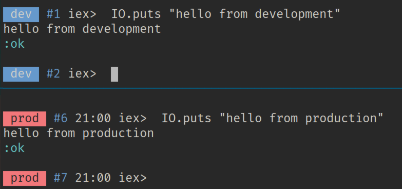

I suspect that every developer who has dealt with production systems, has also
messed up a production system. At least once.

Whether that was by deleting data accidentally or by manually calling a function
thinking you were safely in your own local version, we've all had that
mini-heart-attack feeling.

I've done it myself. And since then, I make a point to make sure my environment
explicitly tells me where I'm at.

This is how my IEx prompts might look like, depending on which environment I'm
in:



Let's see how we can do that in Elixir (or [skip ahead](#full-snippet) for the
full snippet if you're in a hurry):

## The .iex.exs file

This file can be added to the root of your directory, and works as an Elixir
script that gets executed whenever you start an IEx prompt

This actually means you can add any Elixir code you might find useful.  Setting
up `alias`, or the usual `import Ecto.Query`, is a common use-case.

You can also call
[`IEx.configure/1`](https://hexdocs.pm/iex/IEx.html#configure/1) which, among
other things, let's you customize the prompt, which is what we're doing here.

In my example above, prompt color is based on an `APP_ENV` environment variable,
but being Elixir code, you can do it in whatever way you prefer.
I tend to already have a similar variable available, to distinguish between
staging environments and the real production one.

## ANSI escape codes

Terminal colors are achieved via espace codes: special character sequences that
tell your terminal to change colors.  Elixir supports that natively via the
[`IO.ANSI`](https://hexdocs.pm/elixir/IO.ANSI.html) module.

Go ahead, try out this snippet in an IEx session:

```elixir
IO.puts "#{IO.ANSI.red_background()}#{IO.ANSI.black()} WOW #{IO.ANSI.reset()}" 
```

If you inspect the return of these functions, you'll see that `IO.ANSI.black()`
just returns `"\e[30m"`, which is gibberish for "text color is now black".

<a href="#" id="full-snippet"></a>
## Full snippet

With these two things in mind, you can write an `.iex.exs` file that customizes
IEx prompts as shown in the beginning:

```elixir
#
# .iex.exs
#

env = System.get_env("APP_ENV")

prompt_reset = "\e[G" prompt_color = case env do
  "production" ->
    "#{IO.ANSI.red_background()}#{IO.ANSI.black()}"
  "development" ->
    "#{IO.ANSI.blue_background()}"
  _ ->
    "#{IO.ANSI.white_background()}#{IO.ANSI.black()}" end

prompt = 
  prompt_reset <>
  "\n" <>
  "#{prompt_color} #{env} #{IO.ANSI.reset()}" <>
  " #{IO.ANSI.light_blue()}#%counter#{IO.ANSI.reset()}"

IEx.configure(
  default_prompt: prompt,
  alive_prompt: prompt
)
```

## Applying to Elixir releases

The last step is to make this available in production. Elixir is often packaged
via `mix release`, which doesn't consider `.iex.exs` at all. Luckily, copying
the file over to the final release's directory seems to be enough.

Let's say you're using a `Dockerfile` to publish the release, and `/app` is the
root of your application. Just add:

```docker
COPY .iex.exs /app/_build/prod/rel/.iex.exs
```

## Wrapping up

Not much to say here, it's a rather small tip, but one I found very useful since
first implementing it.

Drop me a line on [Twitter](https://twitter.com/naps62) if you have any thoughts
or related suggestions. 🌮👋
