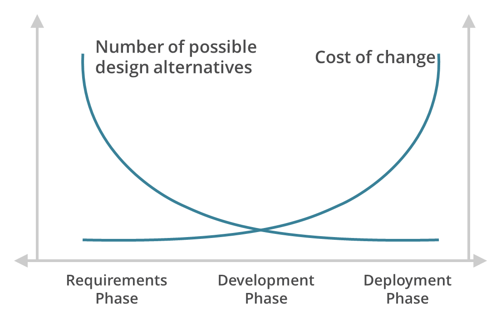

Starting with one assumption: *When we build products for the world wide web, we won't ever be able to fit everyone's needs.*

Perhaps, this one is rather easy to accept. 
After all, there is no one-size-fits-all, with all companies being advised to find their market fit and to focus on one target at a time. 
If nothing else, the language barrier of covering over a hundred languages would automatically declassify almost all of today's live products from disproving the assumption. 
This is without even considering full localisation to countries and/or even regions. 

But even when we decrease the scope of our target, there are still a hundred reasons for perfection to never be achieved. 
At any moment, someone else could build a product that would be either be faster, easier to use or encompassing more functionality. 
After all, you can build a product for anyone else in the world. 
This means that competition is enormous and the pace that technology development happens is, at least to me, still mind-boggling. 

Anyone who works in tech products knows that by the time you solve one problem, you will find 10 more. 
This is the second assumption, tech products are never finished while someone can still work on them. 
This never-ending task of improving a product is one that thousands of companies live for until the day they can expand to have more and more products in their offering. Take Amazon which started with an online bookstore, or Google with a search engine, Facebook with one social media or.. so many others. 
You might think it is only the giants, but all companies do this to an extent. 
Spotify started with music streaming, they now have podcasts as well and have bought more than 15 companies in several different areas. 
Where will they expand to next as they dominate their market? 

Hence why, when we take these two assumptions hand in hand, it is easy to deduce that part of what everyone needs to do is **choose**. 
Thus, I wanted to reflect on this burden, the burden of choice. 
It is of such importance that whoever would be able to crack the prioritisation code that leads products towards success could potentially spearhead most economic developments. 
E.g. If you have that godly talent (omniscience) to make all the right decisions, please head to any startup tackling climate change in a grand way, to ensure their products are able to grow within the shortest timeframe and with the greatest efficiency! Having said this, here comes a round of disclaimers:

- This is by no means the holy grail of making product decisions. Just a reflection by one individual on the subject.
- Since often in a Product Managers' world, prioritisation tends to be seen by.. everyone else, as a topic out of the scary, obscure underworld, where great ideas all are rejected. Be aware that this post uses the words choosing and prioritising interchangeably. So you can hate on the word **choice** and, just in case, murder **option** as well 😜!
- If you have differing opinions at any point, that's good. Instead of venting to your wildest screams, please do reach out! Would love to have a chat about these topics.

To further strengthen the point about having to make decisions on what to tackle, we can also look at the triangle of 😱Project Management😱. 
Put simply you can **choose** 2 out of good, fast, cheap. 
And because it is not always possible to trade between constraints, consider the following. 
If you want a product that solves everything for everyone and cheap you'll wait indefinitely because, by the time you are reaching the initial goal, it will be outdated anyway (remember the assumption of fixing a problem, for 10 to pop up?). 
If you can actually put money into it, well, often overstaffing will compromise quality. 
A terribly bad example of this last one, Google+, the kind of product that wouldn't have been possible to build in a startup with that reach anyway. 

Making product decisions is not a straight path either. 
In fact, choices made at the beginning of a product can shape dramatically the road ahead. 
That's where the cost of change comes into play.

### Cost of Change

As Nikita Savitskiy, a former Product Manager and Service Designer at Utrust, used to point out: "Don't forget the cost of change".

Nikita's warning was particularly directed at the importance of setting time to research and discovery instead of skimming over one or two market signals. 
There is no doubt that this is one of the fundamentals of good decision making, to be informed. 
Both from the perspective of deciding **what** to build, and **when** to do so. 
*The best moment to change something is before you make it, the second best is now.* Nop, I did not just adapt one of those fancy overused quotes, it's just your imagination. 🙄

*Image from [phaseiidesign](https://www.phaseiidesign.com)*

Expanding on this concept, I see 3 main takeaways. 

1. Cost of Change at the beginning of the product. → More severe in the early stages, e.g. If you chose to use Rails 2 years ago, and would like to change it now, it can be quite difficult albeit obviously not impossible. You simply need to really ensure the problem you are trying to solve will compensate for the huge cost of change you are likely to have. No, I'm not saying Rails is slow, but you thought about it, didn't you? :InsertTrollEmoji: Hey, can someone prioritise troll emoji? Please?
2. Cost of Change as part of a product lifecycle → Usually the one used, just like the image above.
3. Cost of Change are one of the reason why roadmaps can't be built from a backlog of functionalities you can choose at any given time.

The moment you implement a decision, your future options become more limited, and your speed perhaps slower as well. 
Any attempt to either go back or move forward will be constrained. 
You have added to your product new responsibilities. 
These are now your responsibilities as they are also potential points of failure and anything you do going forward will have to take that into account. 
It's not entirely avoidable, sure you can try to keep your product as flexible as possible but the effort it will take as some point will be far bigger than the one you can afford (a callback to project management triangle). 
Hence this is the life of any problem. Let me attempt to parallel it to humankind. 
In the first years, you learn the basics, from walking to speaking and your personality becomes more and more ingrained. 
However, at some points, those habits become limiting. 
Changing becomes harder. 
Try changing the way you walk now. 
You can, but you'll frequently fail miserably. 

One of the takeaways from Cost of Change is that Roadmaps can't be set for a long timeframe. 
Instead, as Giles Colborne compared on [this post](https://www.shopify.co.uk/partners/blog/product-roadmap), roadmaps are like rock climbing. 
You have a plan of which holds to grab first, as you proceed you choose the next best ones available to you, and quite a few get left behind never touched, while you keep striving towards the Vision and Mission. 
Often when people think of a Roadmap they expect to see a plan filled with milestones but what tends to be forgotten in those decisions, the choice was to NOT tackle plenty of opportunities. 

<blockquote class="twitter-tweet">
pm tip  always make visible the opportunities you didn&#39;t select to pursue ... and the interventions you didn&#39;t select to pursue (and candidates to try next).  in many ways, this is more helpful context than describing what you actually selected. <a href="https://t.co/LxwDKNFlLq">pic.twitter.com/LxwDKNFlLq</a>
&mdash; John Cutler (@johncutlefish) <a href="https://twitter.com/johncutlefish/status/1310628556779565056?ref_src=twsrc%5Etfw">September 28, 2020</a></blockquote>  

Indeed, as I have recently read, roadmaps metaphor should be more clear when we consider the following example. 

They are a map that shows the possible forks along the road. 
It is your choice to choose the direction to take in each fork. 
If you look at the map, you'll see that a lot of paths weren't taken, in some cases, they will never be taken, as the **cost of changing** direction entirely will not be worth it. Every decision you take is shaping how your product will be in the future. 
The roadmap is simply the current representation of the choices you have made in the past, the ones you plan to do now, and it is increased by the ones you still can take. 
Just remember that the destination shouldn't change.

## Burden of Choice

But really, who is responsible for these decisions? 
After going on for quite a bit about both the importance of making decisions in a product and why it is such an infinite dynamic cycle, it is a question that I still haven't touched upon. 
Who can we blame when the goals haven't been reached? 
TELL ME WHO'S THE SCAPEGOAT!!! 

Although the scapegoat will obviously be the Product Manager when it's not the Project Manager, of course, which won't be if it's the Developer who clearly will point at design, hold on, it's the Product Manager as specifications were bad. 
Anyway, I'm sorry but, in my view, the ideal answer is either everyone or.. no one. 
Each role in a company has certain expertise and perspective that should be reflected in the decisions that are taken. 
From founders to the support team, from the developers to sales and marketing but also operations, finance and most importantly to the users. 
If you are unable to combine their side of things your decisions will be less informed than they should be. 
And sure, it should be a Product Manager's responsibility to ensure this is happening, but it's not only up to them, at least it shouldn't be. In the examples I used in the beginning, the success of the company is dependant of the product. 
If that is the case, avoiding and trying to hide from prioritisation processes is but neglect. 
It is on purpose that Product Managers should lack full authority. They do not manage people or teams. 
They have the core responsibility in developing processes that are able to create the roadmap, by ensuring there is alignment between all experts, but they cannot choose all the forks themselves, no one can nor should.

So many words, and yet it all comes down to having the data to make decisions, discovery is but a part of that. 

Another part of this burden is that in hindsight "*we should have done better"* is a common de-motivator. 
Guilty as charged here ✋. 
In hindsight, the answers are crystal clear. 
Just look back at the rock climbing example, usually, you couldn't have known, because you didn't have the right processes in place, or because you were simply unlucky. 
There are far too many variables in place, the world keeps changing. 
Don't ever hold yourself back for past decisions. 
Just recognise what can be improved in the future. 
After all, the harsh truth is. 
No one is ever 100% confident. 
You don't know the future nor everything that is happening right now in the market. 
At the end of the day, it will always be a gamble. 
However, one that you can cheat through observation (research/discovery) and wit. 
These just increase the odds of winning. 
And sometimes, the problem you are trying to solve is not the right problem, so just try to catch that one early 😜. 

## How we do it

Here comes the miracle solution. 
What you should do if you want to succeed. 
The solution that will beat all others. 
Not really. 
Just a few processes we are using at Utrust, adapted to our own team and situation, which kinda is what the industry recommends for you to do anyway. 
Still, they have been working so far, and we are constantly iterating and improving them, just like you'd do with a product. 
Services are products, processes are products, people are products! 
Everything is a product! 
Oh, nop. 
Not Oprah deja vu. 🙄

First of all, we defined our own Company Vision and Mission 😱. 
Pretty basic right? Then, we also set the Goals for each department based on the above. 
We created a process to collect feedback internal and external. 
We created a research team. 
And we built a prioritisation chart.

On the former it goes something like this: bla bla bla a new problem shows up at the door, and we need to choose whether we tackle it or not. 
So we do **ICE**!

As in:

**Impact - In** Business & in Users

We separate Impact as Business Impact and User Desirability. 
The first is measured by stakeholders in the business. 
The second by PMs with Designers and help from support roles, we don't have a dedicated user researcher at the moment. 

**Confidence**

Based on how much data we have of the theme and to back the numbers for Impact and Effort, we set a 0 to 100% confidence. 

**Effort**

Finally Engineers try to see what would be the effort in solving this. 

So then, PMs propose changes to the roadmap based on the highest scores (but not only, numbers serve to inform decisions, not to make them) and get approval from leadership. 
As we pick topics in the roadmap For new products, we prototype, followed by an MVP and then perhaps to tackle the products' roadmap. 
For smaller themes, we do mockups and validate them with users before moving to delivery. 
We then try to see what we delivered, whether it fit what we expected, and try to learn from that. 

Although I oversimplified a lot, it sounds great right? 
Is it flawless?
Not at all. 
I can pinpoint you at least 5 areas of improvement that we can make today, and that's what we are doing. 
I estimate it will be a neverending process. 
And I challenge any company to say they have absolutely no challenges! Just like a product, there are drawbacks in approaches, and teams are constantly changing as well. 
Do we invest more into research? 
How much and what do you sacrifice? 
How do you combine and drive decisions out of the hundreds of things that are currently happening in the market and around your company that could shape what you do? 
There isn't a perfect process. 
There are simply great ones that solve your current problems. 
Also, if you want to read more about ways to handle these types of processes. 
I can recommend [a few books](https://uxdesign.cc/a-product-managers-bookshelf-4a0c036c3df6) 😃 

## Takeaways

There are a few key lessons I'd like to sum-up that can, however slightly, ease the burden of choice:

- Be informed. Create the processes that enable you to collect and process information in a way that it will decrease the infinite number of choices to a few sensible ones that fit your current situation. Data beats gut feelings all day.
- Risk it. When everything else fails, and even when it doesn't. Risk is part of a product journey. When you look back at the decisions you have taken, everything seems easier. You are not omniscient so failure is bound to happen. But if you are trying to solve a problem for some users, you are already on the right path.
- Never let go of the Mission and Vision. That's your end goal, remember? If you don't, imprint it again. You'll get lost in the forks up ahead otherwise.
- There is no perfect solution. There is never a process that fits everyone. No, it is not Spotify Squads system. Identify the problems you are facing, and learn from them.
- A product's strategy is core to a company's strategy. It is not just one team's burden. It is the company's burden. Be involved, and involve others.
- You are doing all of this to solve a problem (or multiple ones) for someone. If you don't know that. Go read the Company's Value Proposition again. Or change it.

These are notes for me perhaps more than anyone else. 
I can guarantee you that this year alone I failed at each one of them, even if for just 1 day 😅. 
If nothing else I'd like you to take away one thing. 
A product is a complex bundle of past, present and future choices that should be made by a company that is informed both through shared processes and of its own bias. Your burden is to have an impact through the expertise of your role. 
If you are a PM, to ensure these processes are built and that everyone's expertise is taken into account.
