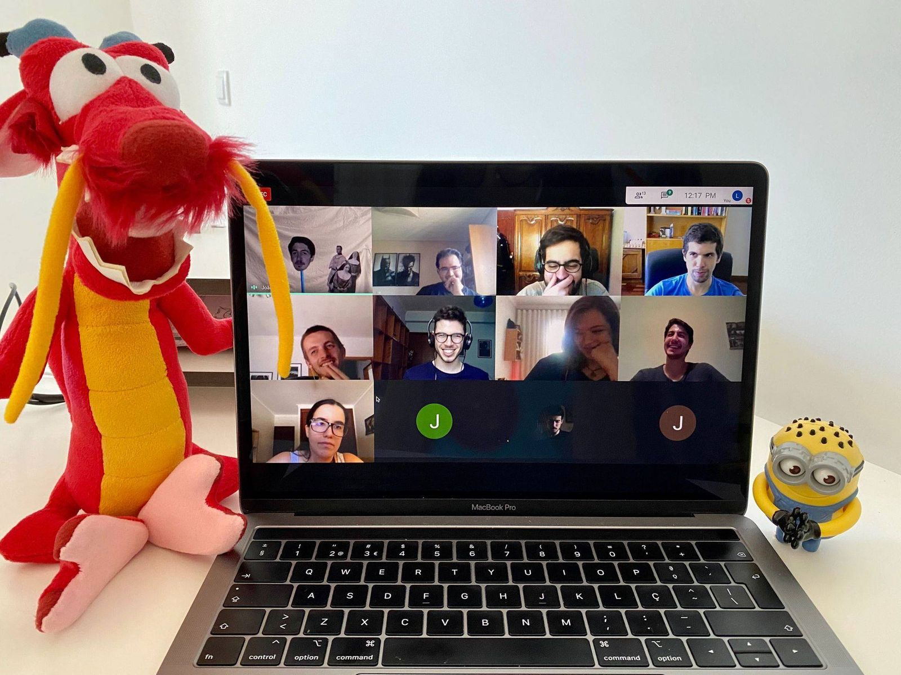
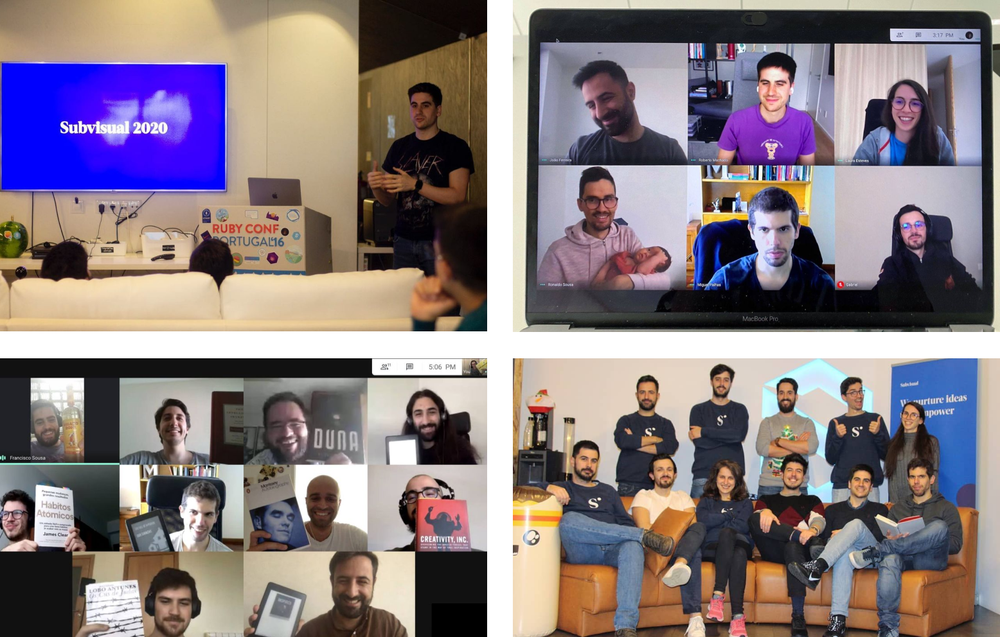

So, 2020... quite a year, right? Somehow it feels like ages but we're writing
you to wrap up this massive year and let you know that we're here, we're
healthy, grateful and optimistic for 2021.
 
**At Subvisual we are infinite learners and this year was no exception. Here's
some of our key take aways:**

## Moving to be fully remote

Going remote was a [huge challenge][going-remote], as we can all attest...
[here's what we did][work-at-subvisual].

## Growing as a company: new processes, people and Cambridge (MA)

We've put effort into expanding our capacities and to boost our strategic
business operations both as a venture studio and a digital product development
provider. We hired a Head of Ventures, a dedicated Business Developer and we
reinforced our bet on the North American market. Drop us a line and don't lose
the chance of meeting [Michael], our Managing Director in Cambridge (MA).

## 35+ new projects

During 2020, we've worked on more than 35 projects alongside companies all
across the world. We've collaborated with partners in industries as diverse as
health, finance, insurance, and consumer goods.

**Actually, summarizing everything helps us to see that 2020 was a very good
year:**

* We worked on a handful of meaningful projects in the Fintech and Blockchain
  world, such as [Filecoin], [Omise], or [Universal Protocol]'s [UPCO2
  project], reinforcing our position as innovators and problem-solvers in this
  industry. In fact, [Portugal Fintech] featured some of Subvisual' powered
  ventures on their [annual report][portugal-fintech-annual-report], making us
  even prouder of the road we've been tracing;

* Subvisual Universe' members are also growing: [Utrust] launched [Hold] and
  keeps adding new merchants to their list, [Sioslife] brings out [Seninc]
  &mdash; an innovative tablet specially designed for our elder friends and
  family &mdash;, and [Coverflex] prepares to onboard their first customers on a
  revolutionary solution for compensation, managing benefits, discounts, and
  insurance that makes it easy for companies and people to make the most of
  what they get;

* Subvisual Live Talks invited 14 guests. We had the pleasure of leading
  conversations with such amazing people as [Netlify]'s Principal Developer
  Experience Engineer, [Cassidy Williams], [Todoist's CTO, Gonçalo Silva],
  [Webflow's Co-Founder, Bryant Chou], and [Basecamp]'s Head of Strategy, [Ryan
  Singer], along with other incredible guests in the tech world;

* We're content producers! This year we've published [30 articles][blog]
  covering topics such as team and talent management, business, investments and
  technology. Our ambition is very clear: we like to think of our company and
  our Universe as a place where we learn by sharing, and share while learning;

* We have two big announcements for **Elixir** adopters and curious developers
  and entrepreneurs: we're launching an outline on why or if you should choose
  Elixir for Startups and we're announcing a new edition of Subvisual Elixir
  workshop, focused on CTOs - soon to be launched;

* We continue our efforts and commitment with social challenges and our
  communities by supporting meaningful social impact projects such as
  [Tech4Covid], [Portuguese Women in Tech], and through our involvement with
  the design and development of a regional Covid-support community,
  [MinhoCovid19].

Well, if you're reading this, it means that, somehow, you're part of the [happy
story we're trying to
build][our-story].

We're grateful for a very meaningful year. Challenging times require empowered
communities, trustworthy partners and an optimistic perspective.
 
In 2021, Subvisual will continue to expand business operations so that you can
rely on us as trusted partners for new products, innovative thinking, or even
for launching a new venture.

Also, we would like to share that we're launching something new and perhaps you
will have interest to know more about it.  It's a training program that we hope
to help us grow technologically and as business leaders, professionals and as
individuals. [Drop us a line][contact] if you want to be invited to exclusive
sessions with worldwide experts and business leaders on how to develop and grow
digital products and companies.

Thank you for being part of this journey. Please, enjoy life and have fun
during this season and throughout 2021. Stay safe and [stay
tuned!][subscribe]
 
Forever learning, **The Subvisual Team.**

[going-remote]: https://subvisual.com/blog/posts/going-remote/
[work-at-subvisual]: https://subvisual.com/blog/posts/what-it-feels-like-to-work-at-subvisual/
[Michael]: https://www.linkedin.com/in/rmfallon/
[Filecoin]: https://filecoin.io/
[Omise]: https://www.omise.co/
[Universal Protocol]: https://universalprotocol.io/
[UPCO2 Protocol]: https://universalcarbon.com/
[Portugal Fintech]: https://www.portugalfintech.org/
[portugal-fintech-annual-report]: https://twitter.com/subvisual/status/1321847382338949120
[Utrust]: https://utrust.com/
[Hold]: https://hold.io/
[Sioslife]: https://sioslife.com/
[Seninc]: https://sioslife.com/seninc/home
[Coverflex]: https://www.coverflex.com/
[Netlify]: https://www.netlify.com/
[Cassidy Williams]: https://www.youtube.com/watch?v=I3hlEMjuuao&t=2s&ab_channel=Subvisual
[Todoist's CTO, Gonçalo Silva]: (https://www.youtube.com/watch?v=R7QOmJj9CxU&t=1122s&ab_channel=Subvisual)
[Webflow's Co-Founder, Bryant Chou]: https://www.youtube.com/watch?v=_fEHogqBM9g&t=3s&ab_channel=Subvisual
[Basecamp]: https://basecamp.com
[Ryan Singer]: https://www.youtube.com/watch?v=MTPhuf2EESA&t=2s&ab_channel=Subvisual
[blog]: https://subvisual.com/blog/
[Tech4Covid]: https://tech4covid19.org/
[Portuguese Women in Tech]: https://www.portuguesewomenintech.com/
[MinhoCovid19]: https://minhocovid19.com/
[our-story]: https://subvisual.com/blog/posts/8-this-is-our-story/
[contact]: mailto:contact@subvisual.com
[jobs]: https://jobs.subvisual.com/
[subscribe]: https://subvisual.us5.list-manage.com/subscribe?u=79f7816bac08905f81c1a8689&id=f8b8f31221
