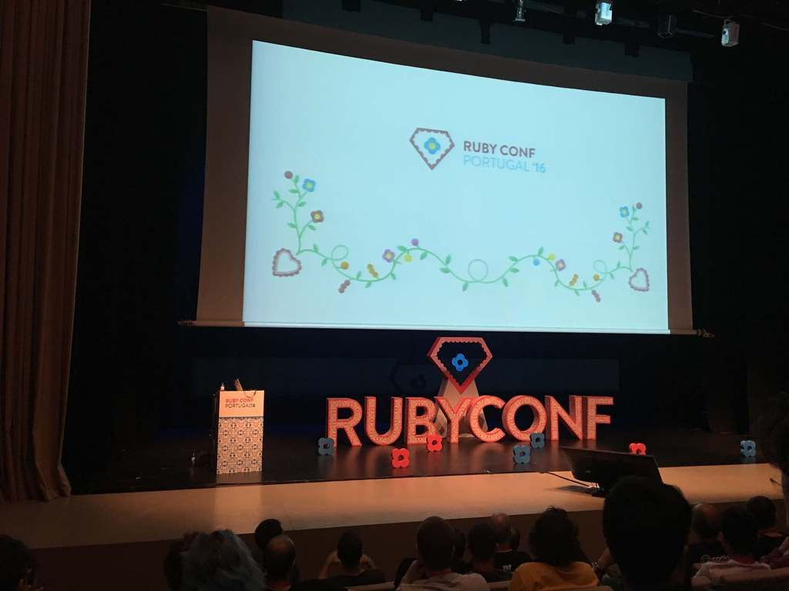
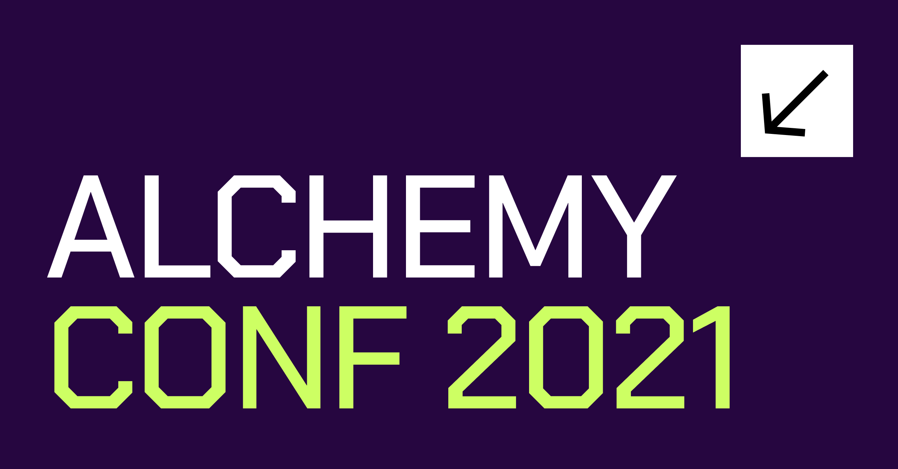
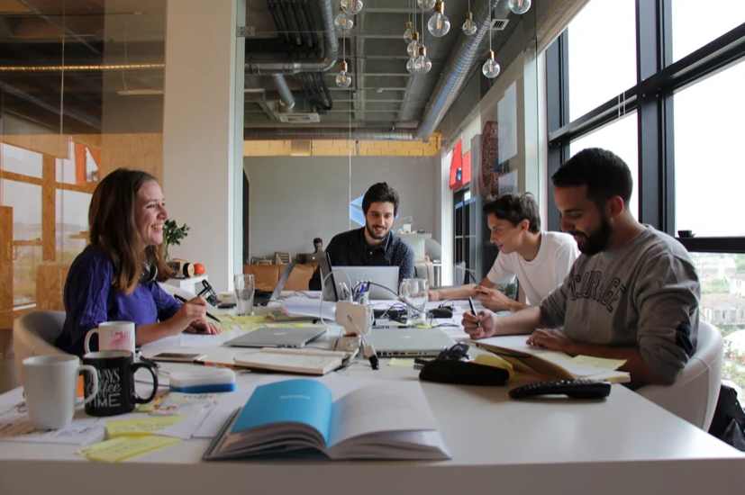

Pandemics brought us apart, so many other circumstances seem to focus so much
on splitting us, rather than connecting us to each other, and yet, perhaps,
this is a time where getting together makes more sense than ever.

At Subvisual we see ourselves as community builders. We don’t do it because of
some “phony” tactics to have some sort of return, but because belonging to
a community matters to us and gives us back an immediate sense of fulfillment.
Since our early days, we’ve been creating events that bring people closer to
each other while exploring the latest industry, artistic or scientific trends.

We are very proud to have hosted a couple of editions of
[RubyConf](https://2016.rubyconf.pt/) and [MirrorConf](https://mirrorconf.com/)
while getting to know amazing people and talented professionals with so many
diverse backgrounds. 

As community builders, we want to step forward and bring people back
together, again. This time we thought we could start by calling out for the
Elixir community and that was how we came up with the [Alchemy
Conf](https://alchemyconf.com/).

Alchemy Conf is a one-day event where all Elixir, Erlang, and BEAM developers
and enthusiasts come together, share knowledge, find out who is in the community
and what is it about. Also, we decided to make it a non-profit, carbon-neutral
conference. All proceeds go to charity and we will plant a tree for each
attendee joining us.

This is a call to action for all of you who care for belonging, nurturing
a community, and leverage technology. [Come together!](https://alchemyconf.com/tickets) 

----------

Also, if you want to pursue a career in technology and product, applications
are open to our **Summer Camp** program.

This is a full-time, remote program, that will take place between June 29th and
August 24th. We are looking for new graduates or college students who are keen
to learning fast and want to acquire knowledge. Accompanied by Subvisual
mentors, 2 developers, 1 designer, and 1 PM will form a team and build
a product together to solve a pre-defined problem.

The purpose is not to create a product ready to be launched but to give you
a taste of what it is like to work on a team and build a product from scratch.

[Sounds interesting to
you](https://subvisual.com/blog/posts/apprenticeship-and-summer-camp-programs/)
(or anyone you know)? Click
[here](https://jobs.subvisual.com/summer-camp-program/en) for more info and to
apply! 

----------

Thank you for being part of this journey. Take this newsletter as our heartfelt
way to reach out to all of you, friends, and don’t lose the chance of [reaching
out](mailto:contact@subvisual.com), anytime. 💙
 
Forever learning, **The Subvisual Team.**

