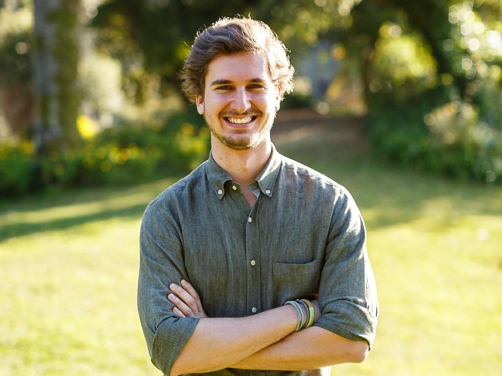
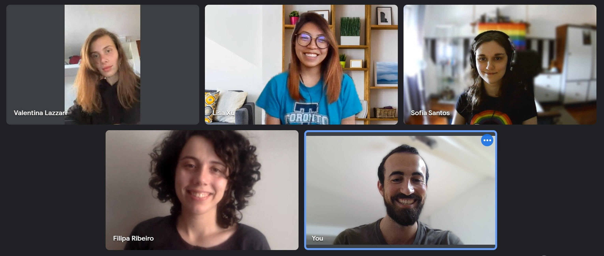

Is it just us or do you also feel like this summer has gone by in the blink of an eye? It’s late August already, can you believe it? Time flew by for our campers who have been actively engaging in all their Subvisual Summer Camp activities.

At Subvisual we believe that it’s possible to have a real job experience and professional growth during summer while also having fun. That’s why we created our Summer Camp in the first place: **to share experience, to help each other and to make this a beneficial experience for all involved parties** — a “win-win” experience! 

The campers are growing, learning and working on the internal product and our team is also learning how to coach, guide, lead and manage. We, of course, did not invent the Summer Camp concept, but we wanted to make ours special by working with diversity within both our team and the mentoring program. **We want to share and give back some of our legacy to this new generation who will hopefully create and come up with their own perspectives.**

We provide them with the opportunity to participate in a real life product development process and constructive feedback; we mentor them, teach them time-management, team-work, organisation, communication skills, rhetorics as well as a professional development in their own respective industries.

**We had a chat with Zé Pedro, Summer Camp’s talent manager, where he explained a little better why we do this.**

* **How was the idea born?** 
  We've always conducted apprenticeships since our early days, but we felt that our mentees were somehow isolated and didn't had the experience of working within a team on a product. On the first edition we only had developers and designers, and every year we added profiles to the team that made it more complete - product managers, marketeers, content creators, etc. Our plan is to keep it always evolving and iterate on this model.

* **Why do you find the idea of the Summer Camp so advantageous?** 
  Our campers are faced with a challenge to build a product, PR it, and deliver it by the end of the program; and they need to interact with each other and face "the client" (our internal product users) to be able to build and promote it. There is teamwork involved, leadership skills, prioritisation, decision making, and sometimes arguments and discussions - that's all part of the real world - but in a safe environment with room for errors and learning, which is the most important. 

* **Would you be open to any adjustments for the future or is this the final version?** 
  I don't know if we'll ever get to a "final" version. Our plan is to keep on iterating, adding or removing roles within the team as opportunities may or may not arise. As long as change is a constant in the "real world" - and it is - we'll keep on changing and adapting with it.

* **Do you believe that having it all online is a liability or an asset?** 
  We're a remote-first company, so we're fully prepared to have everything done online. While it's true that some interaction and human contact is lost, we gain a lot from conducting everything remotely. This year, we were able to recruit a diverse group, with people joining us from places such as Braga, Açores, or Canada. The cultural enrichment, diversity of perspectives, and ways of working all contribute to a better experience for all our campers. 

* **What’s your favourite part?** 
  Definitely seeing the campers grow, while also learning from them. During every interaction, from the start to the end, you can feel the enthusiasm present and that translates into curiosity and evolution. Its energising to see their positive attitude of wanting to take the world by storm!

* **How does the camp deepen the integrity and corporate culture within the company?** 
  Programs like the Summer Camp deeply relate to our company values - People, Learn, Care, Share - and they serve as a reminder of why we do what we do and get us back to our purpose. Participating in the Camp as a mentor can serve a powerful refreshment to one's motivation and sense of contribution. Helping others is one of the basic pillars of happiness!

* **How would you describe a perfect candidate?** 
  Curious, enthusiastic, ambitious. We pay only the necessary attention to college degrees, so these 3 traits - and how you show them and did in the past - will make or break your application!
 

 ---

 ### A brief team introduction

This year’s team, which you can check out on [our Instagram page](https://www.instagram.com/wearesubvisual/), is more international than ever. We have people from different parts of Portugal, including the Azores, as well as from the Czech Republic and Canada, and each of them has so much to offer! 

Who would ever say that our product manager is also a passionate wine maker, or that one of our developer has a journalism background. Our UX designer has the cutest cat, the content creator is a passionate equestrian and our developer is into PS5! 

### And a bit more on how the process is going

The Summer Camp has gone through multiple phases. First the campers participated in general introduction meetings and were exposed to the process. Next, the [design sprint](https://www.gv.com/sprint/) actually took a place, which ended up being very consequential as, for some of them, it was their first experience with spring planning. 

Thanks to the framework the campers established, they’re having “Daily Stand-ups” to update each other on their tasks. 
Also, they were faced with the challenge of interviewing some of our Leads and Managers to gain  a relevant understanding of the specific needs that the solution they are building has to fulfil.

The next and final step will be to present the final solution to our Universe and hear the feedback from the team. We’re sure it will turn out great! 
Keep an eye out for our next newsletter and our social media pages, where we'll be sharing more on how that went. 
