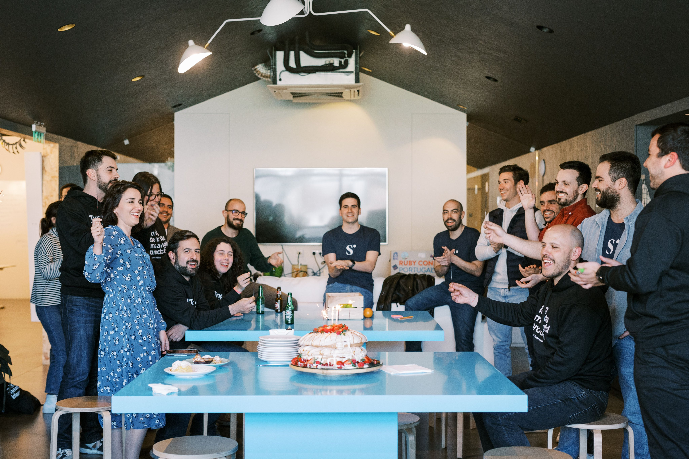
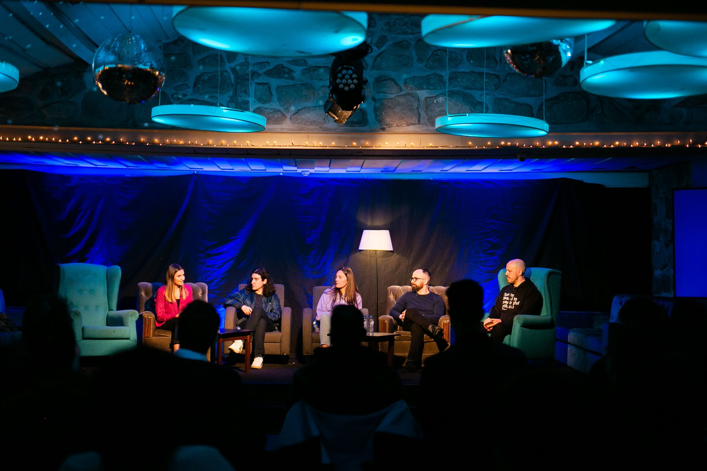
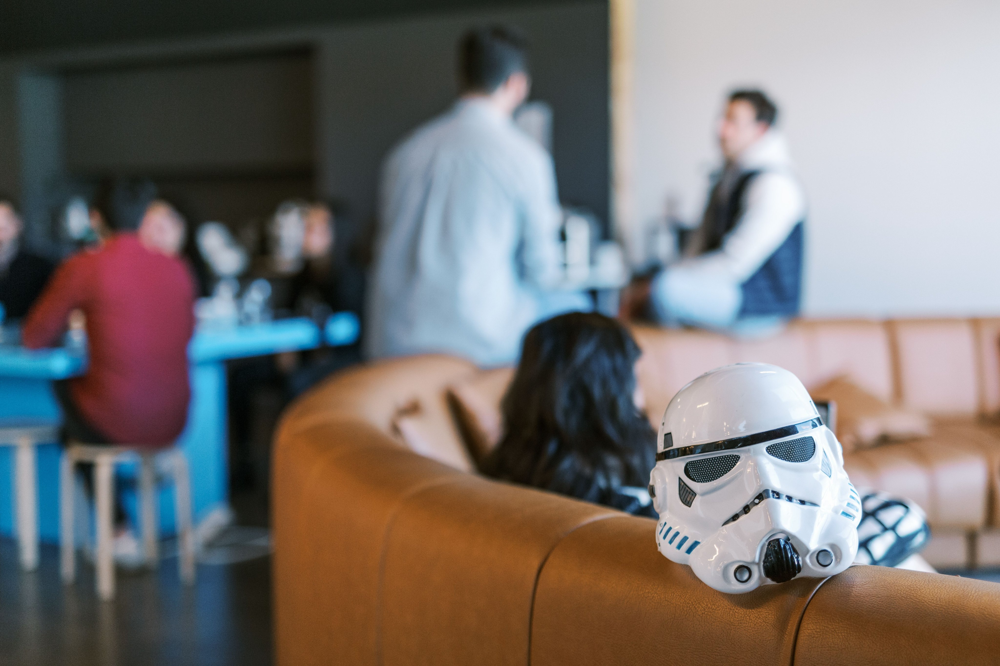

Hello there, Subvisual friends and fam! \
 \
With the right cocktail of hard work, dedication, talent from the team, and a strong focus on delivering, even complicated years like 2022 can be full of accomplishments to be proud of.

Here’s a little recap of our business exploits this year, and how we managed to make our 10th anniversary a massively successful one.

Because yep, it’s true. This was the year we completed an entire decade in this industry. It’s incredible to think of the wonderful trip we’ve been on for such a long time. When we got started, we were just kids, straight out of college.

We celebrated in style at Denites Braga, with our community at our side. Gatherings would become a bit of a theme for 2022, after the struggle to connect in person of the last few years.

We truly put lockdowns behind us with two wonderful retreats, where the team got to see each other, meet each other, and share plenty of ideas, stories, and goals.

As if that wasn’t enough, we also managed to run the 7th edition of our Summer Camp!

Fortunately, we got to be with everyone else from around the industry too. We hosted not one, not two, not three, but eleven community events in 2022:

* Two Universe Summit;
* Three Braga.Blockchain;
* Five Coimbra.Blockchain;
* The awesome Denites week in Lisbon.

Not only that, but we were fortunate enough to attend four tremendous conferences:

* NEARCon;
* DevConnect Amsterdam & Starknet Bootcamp + Starknet Hackathon;
* Activate Miami
* Lisbon Blockchain Week;

We launched Station and Impact Evaluation projects on LabWeek. If you met any of us in any of these events, drop us a line below, we’d love to hear from you.

On the business side of things, we’re proud to say we supported a number of incredibly powerful projects. We suspect you’ll be hearing a lot about Sandclock, Avenue, Fantera, or Bhout in the very near future.

Follow them now, trust us.

Not only did we work with incredible projects, our own group grew at a riveting pace in 2023.

Onda Studio, Pink Room, Finiam, Subvisual and Invisible Lab can proudly say we have handled over 100 successful projects this year.

In 2023, we want to fly even higher, and the right way to do it is always to study the successes and the failures and learn from both. We’re thrilled to report, however that the former far outnumbered the latter. This year, we celebrate the wonderful success of some of our incredible alumni.

Here are some highlights:

* [Utrust](https://utrust.com/) was acquired by Elrond Network;
* [Coverflex](https://www.coverflex.com/en-pt) is expanding internationally;
* [Decipad](https://app.decipad.com/) launched and is growing consistently;
* [Framedrop](https://www.framedrop.co/) closed a seed round.

Shoutout as well to our services companies. They grew significantly this year, thank you [Onda Studio](Ondastudio.co), [Invisible Lab](https://www.invisiblelab.dev/), [Finiam](Finiam.com) and [Pink Room](https://pinkroom.dev/).

Last but not least, we want to thank you: our community. You’re always there for us, showing up to the events, giving us your support when we need it, and incredible vibes every day of the year.

We couldn’t do it without you, and in 2023 we will continue doing it for you.

Cheers! 🥂