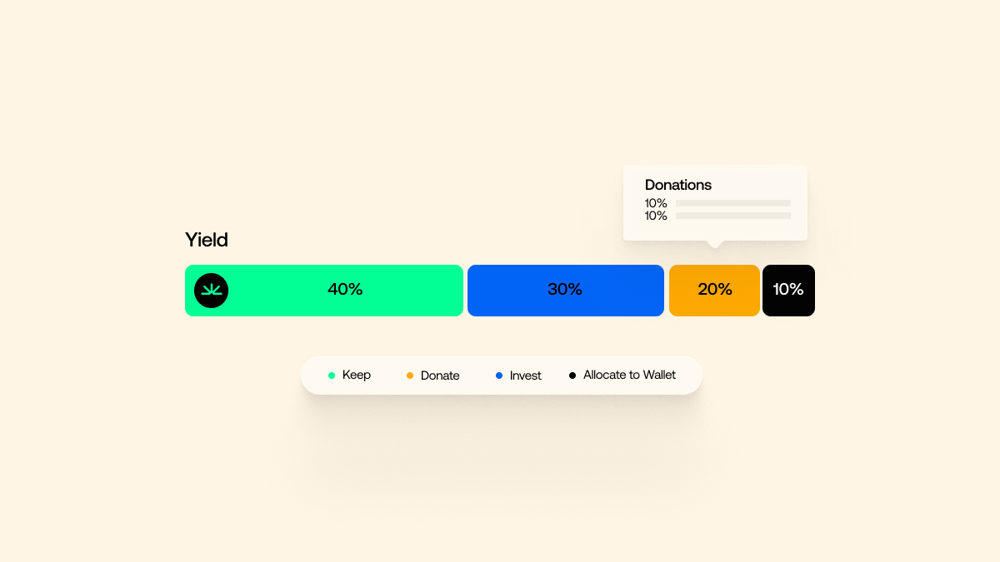
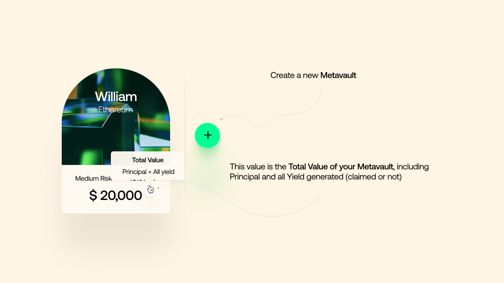

### Why creating something entirely new requires tried and true methods

Sandclock is a DeFi product. What it does is new. No other product on the market does anything like it.

I mean, we don’t want to brag, because in blockchain a lot of things are copies, but there’s plenty that’s cutting-edge and new. Still, it’s true that there’s no other product out there that does what [Sandclock](https://www.sandclock.org/) does. DeFi stands for Decentralised Finance, and it’s blockchain technology applied to all kinds of financial operations. Instead of having a traditional institution (e.g. a bank or a broker) deciding what kind of financial operations you can perform or not, as well as charging you for the privilege, DeFi removes intermediaries.

If you’re interested in the concept, our friends at Utrust have written an entire article about the subject you can find [here](https://utrust.com/blog/why-defi-part-1/).

In a nutshell, DeFi allows for financial operations using crypto. So what distinguishes Sandclock?

### Make your yield work for you

Sandclock has created a very special, very unique form of something called a metavault. A metavault, to put it simply, is a digital vault where you can store cryptocurrencies. The reason why you’d do this is similar to the reason why you’d do so in traditional banks: you lock up your money and it grows.

Traditionally, when you deposit a sum of money, your intention is to generate yield. You put your money in the bank, you lock it, and you get an interest rate.

The main problem with this method is obvious. To benefit from the yield, you have to give an institution control over your money. If you lock it up, it’s not under your control anymore.

So when Sandclock went about creating the cutting-edge blockchain version of this, they knew they wanted to make it better. Whatever solution Sandclock created had to conform to the principles of DeFi: no centralised control.

Furthermore, the founders wanted to bring an element of philanthropy to the project. They wanted people to be able to dedicate their yield, or at least a part of it, to social causes of their choice.

But how do you teach the blockchain to redirect the funds correctly, and, at the same time, avoid forcing people to give up control over their vault to a centralised institution?

This was a big technical ask for a brand new startup.

### We know how to build

Sandclock’s founders quickly realised that if they were going to make their product a reality in the easiest, most seamless, possible way, they needed help.

The biggest contribution we can make, as Subvisual, is when we actually manage to fully sync with the project’s leadership and help them understand how to reach their own leadership style in an organised and effective way. It’s not that we have a formula, but we do have a ton of experience. We know where the pitfalls are, and we know how to avoid them.

Sandclock’s process would, inevitably, have plenty of pitfalls. The product didn’t exist before the team invented it. It had never been done. The technical challenge was immense.

There were weeks where we weren’t even sure we’d be able to do it at all. We’ve been doing this for a while now, and there were a couple of times where we almost threw in the towel. We were legitimately concerned that what we wanted to build wasn’t even possible.

Here’s how Sandclock’s product works: inside every vault, there is an “engine”. That engine, which can be selected by the user, will determine how the yield is generated, how much of it is generated, and what your options are to use it.

In this engine metaphor, Sandclock is the car. It’s the chassis, the wheels, everything else. We can adapt our car to any yield farmer in the Web3 world. Your metavault, your choice of what engine to use. The beauty of it is that once you’re generating yield, your car can take you anywhere. Let’s say you want 50% of it deposited in your vault, and 50% sent to Red Cross. You can do that.

This happens via smart contract. On the blockchain, decentralised, immutable, foolproof.

And the best thing is, the user only has to worry about putting the money in. Everything else is taken care of by the tech. From the user’s point of view, it’s a passive process.

### Building to last

If we were going to help the Sandclock team, the first step was to hire a Sandclock team. Gabriel, Álvaro and João were all involved from the get-go at a very high level, and they not only helped Sandclock’s founders establish best practices for their team, they actually helped get the team together.

Hiring was very time-consuming, especially in the beginning. We had to bring in the right people, and we had to make sure they were able to hit the ground running.

Alongside Gabriel, Subvisual’s Álvaro Bezerra helped develop a framework, based on Bootcamp’s Shape Up. This is the framework we prefer when we have control of the product process. It consists of six-week sequences that allowed Sandclock to plan their development cycles. This, as well as what they call the user-testing mindset, was key for the product to be developed in a very secure way.

According to Gabriel, this is what any prospective CTO needs to instill in their team:

* A six-week cycle has five weeks of development, but the first week is entirely dedicated to planning;
* That week is the key to everything. You can argue about the timings (some teams prefer to do weekly cycles with one day dedicated to planning), but there needs to be one moment that’s fully dedicated to organizing the work, and it needs to be separate from execution;
* Working with product is a lot more about saying “no” than saying “yes”. Typically, there is an overabundance of ideas, and figuring out what to collectively pursue is fundamental.
* Work rhythm is completely disrupted if there is no adequate planning. You are continuously stopping to reevaluate what’s being done;
* If you take a whole week every six weeks to exclusively plan, you can then take longer periods of pure execution that minimise context switching.

A lot of this work was taken over by us in the beginning, which is exactly why we are valuable. Our team has the know-how to implement these methods in a seamless and consistent way that allows us to then dilute our participation and the team to take over as they start to become ready.

This includes everything, from normal technical work, the structuring and information retrieval that goes along with this. Roadmapping. Documentation writing. Gabriel even joined Twitter spaces to answer community questions.

### We ensured quality

The way we do things isn’t formulaic, nor is it rigid. We adapt to founders’ needs, and we always do what’s best for both companies.

And now, Sandclock is entering the market in full force.

The merit goes to Sandclock founder Cristiano, really. Not a lot of people would’ve been able to find ways of making a yield-based product work during a bear market.

If you invest in the stock market, a stock can change in value. You get yield by selling the stock when it’s worth more. What Sandclock’s solution allows you to do is to immediately assign the yield to specific places. You can now program two different solutions both for your initial money deposit and the yield, that can be used by others or sent to them.

### We ensured users would love it

The Sandclock solution will have to deal with large sums of money. This is a big responsibility, and everything had to work perfectly from the very first moment. That means a ton of testing, and a ton of auditing, two things Subvisual makes sure are done well.

We quickly took care of optimizing UX and UI. This can only be done by testing continually. We like to use groups of at least six people to test every step of the process. Since this was such a demanding project, we used up to ten people in the beginning. Whenever we get feedback, we then take the time to let the team iterate. The timing of these things is fundamental, because if we don’t allow the team to actually fix the issues, then we aren’t testing the fixes.

We created a delivery pipeline and a discovery pipeline. We started working in cycles, which is something we prefer. Every cycle implicates working on some things immediately, and prioritise adequately so the planning is in place when the team moves on to the next things.

We believe our greatest impact was in the implementation of all of this, including a number of audits to ensure security was foolproof.

This isn’t even about the tech. This is about securities and contracts. Outside people who are extremely specialised in these things were brought in to ensure everything was perfectly safe and optimised. These contracts have financial products, they will be responsible for large sums of money.

### And we set them up for success

Sandclock fully intends to be a multichain project. The team itself still doesn’t know the true potential of this product. Depending on what different chains can do, the potential is massive. In the future, the hope is to fully program financial flows in a decentralized way, allowing people who get the generated yield to define what happens to it immediately, without any need to run through a centralized solution.

Subvisual has coached both the founders and the team to be ready to steer their company through building this revolutionary product as its potential blossoms.

It means helping everyone understand process. How to deal with the team, how to hire, what behaviors to have to ensure the team replicates them. Culturally, founder behavior is key, and we made sure Sandclock’s leadership knew exactly what to do from the very first moment all the way to now.

### Which is coming now

The first steps for a startup are always the hardest. Not all founders are experienced, and mistakes are inevitable. Sandclock knew that their product was special, and they also understood that in the business they chose there was limited room for error.

This is why they honoured us and brought us in. We have guided over a hundred startups through this process. We know how to deal with some of the nagging issues that make wonderful startups and talented people fail.

In the first 48 hours after the public launch, with limited marketing, the first vault was already holding over half a million dollars.

This is just the beginning for Sandclock.

If you have an idea, or if you are already heading a startup, and you want to skip the hurdles, grow faster, be stronger, then you should know we absolutely love this line of work.

What we did with [Sandclock](https://www.sandclock.org/) is what we can do for you.
