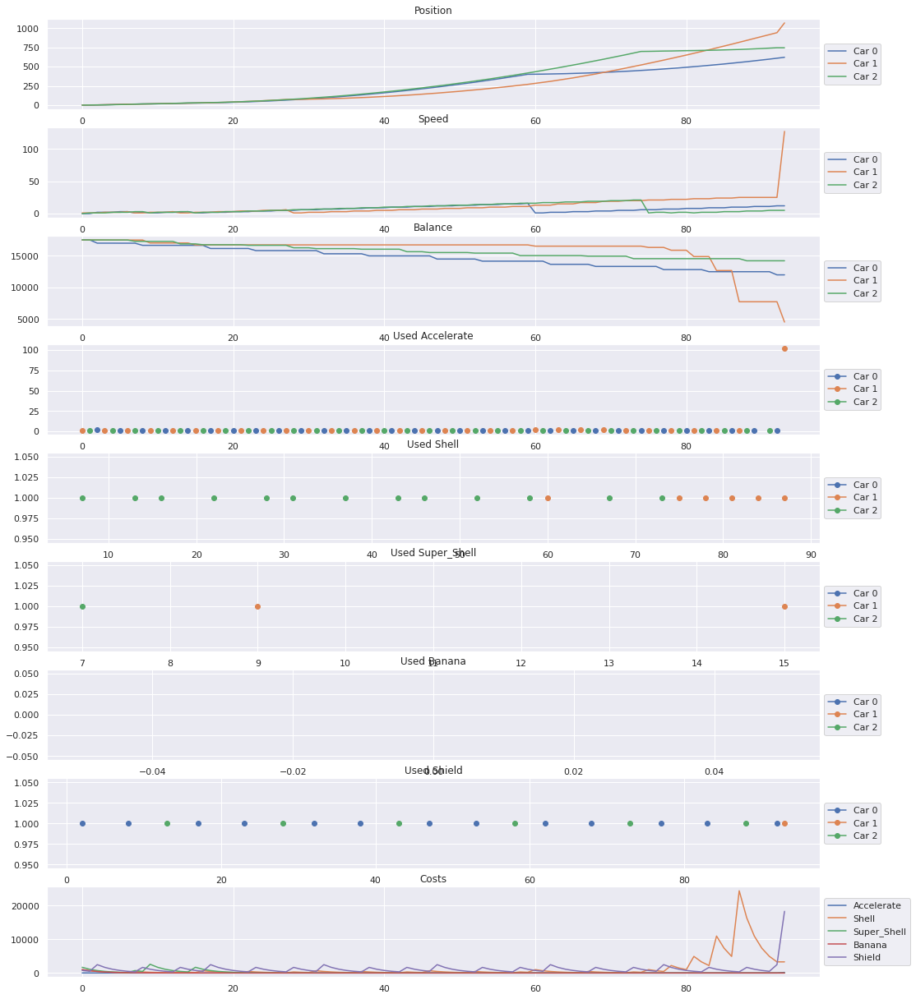

[0xmonaco]: https://www.google.com/url?q=https://mirror.xyz/matchboxdao.eth/-xVvvo36y-LHvrW99heb4VJ-xAOWQ-BQAx6MCwHLWnk&sa=D&source=docs&ust=1676917568372077&usg=AOvVaw2_oBhlTbilNdAPWV2uKQ8T
[gda]: https://www.paradigm.xyz/2022/04/gda
[resende]: https://github.com/ZepedroResende
[writeups-thread]: https://twitter.com/abdulsamijay/status/1561821616778141696
[brock]: https://www.google.com/url?q=https://hackmd.io/@onemanbandplus2/S1Ez1Ulys&sa=D&source=docs&ust=1676917940239184&usg=AOvVaw2kPWeNf1MEDNhGh7Lkeksc
[zellic]: https://twitter.com/zellic_io/status/1620844495226179586
[resende]: https://twitter.com/Resende_666
[elo]: https://en.wikipedia.org/wiki/Elo_rating_system
[foundry]: https://book.getfoundry.sh/
[robocode]: https://robocode.sourceforge.io/
[me]: https://twitter.com/naps62

On January 5th, we took notice of MatchboxDAO’s event, [0xMonaco][0xmonaco].


0xMonaco is a pvp racing game, originally designed by Paradigm for their annual CTF contest. The event is a Mario Kart-inspired racing game, where cars are controlled by a smart contract written by each competing team.

The main mechanics are built around resource management, since each car needs to continuously make decisions about resources to purchase (throw shells at other players, or even speed itself to advance in the race). Resource costs are controlled by a [GDA (gradual dutch auction)][gda], with prices floating up/down exponentially based on short-term demand.

The MatchboxDAO event introduced some variations, such as bananas to attack cars behind us, and shields to protect from incoming shells. It also changed the format of the event itself, with two different days of competition, and groups and elimination stages along the way.
How could we possibly not want in?

So me and [Resende][resende] went at it.

## Learning with speed skating

We went through [all the write-ups][writeups-thread] from the previous edition. [Brock][brock]’s writeup was particularly insightful, as it explained a lot of ideas, some of which worked, some of which didn’t. A lot of initial code was heavily inspired by ideas that came after reading this.

Of course, it was also interesting to read about the exploit. It primed our minds to be just a tad more scheming. We did have a couple of ideas, but sadly not much time to actually pursue them. In retrospect, we should have [thought about it some more][zellic].

Coincidentally, just a couple of days prior, I happened upon the key to our car’s strategy, in the form of an old video:

<iframe width="560" height="315" src="https://www.youtube.com/embed/lfQMJtilOGg" title="YouTube video player" frameborder="0" allow="accelerometer; autoplay; clipboard-write; encrypted-media; gyroscope; picture-in-picture; web-share" allowfullscreen></iframe>

Steven Bradbury won one of the luckiest Olympic medalists we’ve ever seen. His strategy relied heavily on chance, but applied to our problem, it could actually prove to be a much less risky fit.

The strategy is simple: you play conservatively for most of the race, accepting to be behind (but not too far behind) while the front pack wear themselves out, and then you bank everything on a push in the last stretch.

For Bradbury, this worked because everyone else fell (which apparently is not too unusual in speed skating?).
We, however, had much more going for us:

1. By staying behind, we wouldn’t be a target for shells;
2. If we don’t have to worry about shells, then we also don’t need to purchase shields for defense;
3. If we accept that we won’t be competing for much of the race, we can save money to purchase a ton of speed for that final stretch; Furthermore, getting hit by shells drops your speed to 1, which means that early speed purchases will probably be much less valuable than later ones;
4. If the other two players behave as we expect, i.e. battling it out in front, hopefully spending money on shells and speed to keep up with each other, we would expect to reach the final stretch with more funds remaining than either, and not too far behind.

It’s also helpful to realize that, despite this technically being a race, resource management is usually the true deciding factor. No matter how good of a racer you are, if you spend all your money early on to advance 90% of the way, but are then hit by a shell, you’re done. It will be impossible to accelerate for the remaining 10%.

With this in mind, here’s a summary of how our car, named Bradbury obviously, would behave:
We split the strategy into two different branches:

1. We spend most of our time in **Lag** mode, where we focus on saving funds, only purchasing resources conservatively. We are happy with staying in 3rd place, although we keep some control over how far away from the 2nd car we stay;
2. If we happen to be in 2nd or 1st place, we’re in **Hold** mode, where we need to worry about incoming projectiles;
3. Regardless of our relative position, if any car is within 20% of the finish line, we go into **Blitzkrieg** mode.

During all these stages, some form of price gouging is happening as well, sometimes even at a premium price if we have the budget for it. For example, during Lag mode, we have no problem purchasing shells if they’re incredibly cheap, but we may also purchase bananas (useless while we’re in 3rd place) just to prevent others from attacking us.

In both **Lag** and **Hold**, we keep track of our overall spending for each round. We do some math to compute a budget for each round, with the goal of spending some total percentage for blitzkrieg mode (e.g: we may want to keep 40% of our funds for the last 20% stretch of the race).

**Note:** Price gouging is the practice of purchasing a resource purely to control its supply and the market around it. In the context of this game, we may for instance purchase shells, even if we’re in first place and with no use for them, simply with the goal of driving up its price and disincentivizing other players from shelling us.

Finally, in **Blitzkrieg**, we go into crazy mode, and try to spend all we’ve been saving up so far

## Cross-testing

While building the actual code for our Bradbury strategy, we parameterized several decision points. You may find snippets such as:

```solidity
// if we're in second and we have speed?
if (state.self_index == 1 && state.self.speed > 10) {
  //   2nd and is a banana worth it?.maybe buy one?
  //   if no banana, is a shield VERY cheap?.maybe buy one?
  uint256 bought = maybe_banana(monaco, state, BANANA_FLOOR * lag_banana_pct / 100);

  if (bought == 0) {
    maybe_buy_shield(monaco, state, 1, SHIELD_FLOOR / 2);
  }
  aggressive_shell_gouging(monaco, state, SHELL_FLOOR * aggressive_shell_gouging_pct / 100);
}
```

The intention here was to inherit this base logic, tweak these values, and attempt to fine tune them to the most optimal configuration. With this, we were able to generate a decent number of slightly different strategies, all of which with small tweaks distinguishing them, ready to cross-test.
With a few custom variations (lots of them actually), we managed to create a big enough pool of potential cars.

In the meantime, we were also working on a setup to automate the testing:

1. Run a race with each possible combination of 3 cars from our pool;
2. Keep track of all the relative performances of each car;
3. Use an [Elo][elo] algorithm to sort them by performance.

The 0xmonaco repo already conveniently provided the setup to test individual races in the form of a [foundry][foundry] test. With some extra work, we were able to plug it into a Jupyter notebook and visualize our simulations:



Here's the final Elo scores after all the test races:

- **1644** BradburyBigAccelFloor
- **1615** BradburyBiggerEndBudget
- **1523** BiggerBetterBradbury
- **1505** BradburySpeedInBlitz
- **1482** BradburyLagSpeedBlitzSpeed
- **1475** BradburyEvenBiggerAccelFloor
- **1455** Bradbury
- **1430** BradburySmallerEndBudget
- **1367** BradburyGoBananas

While running these simulations of all the permutations in foundry tests worked for a low number of strategies, we realised we would run out of gas with a bigger number of strategies. Furthermore, the noGasMetering modifier and vm.pauseGasMetering() parameters weren’t having any effect.

At this point, we realised we had only one option: we decided to kill a fly with a cannon. We made a custom test runner using foundry as a library. There are examples of a custom test runner in the library found here: [polytope-labs/solidity-merkle-trees](https://github.com/polytope-labs/solidity-merkle-trees/blob/main/tests/src/forge.rs).

We started hacking, implemented a git extractor of all the car versions that we had created until this point and ran all the possible permutations of these cars on a powerful server.
After that, we did the whole python notebook analysis again and chose our champion for the race.

Now, we freely admit this is a heavily biased analysis. We were testing our car against slight variations of itself. We had no way of measuring how it would perform against completely different strategies.
Our initial plan was to write two competing strategies ourselves, which would have allowed us to have more realistic results. But again, time constraints… having a job…

## The race

We are glad to announce that, to the joy of procrastinators everywhere, our approach paid off! During the first qualifier, our car was easily outperforming most other cars, at least for the first few rounds.
As time went on, and people were catching up to the results, they were able to tweak their own strategies and be more competitive. We did gather enough points in the first rounds to secure qualification though.

For the second round, we would be racing against top-seed teams such as Uniswap, NEAR, and many more. We learned much from the first round, but we unfortunately weren’t able to meaningfully update our strategy well enough to remain competitive.

The most successful (and replicated ) strategy ended up being the one that was developed by the Uniswap team, TurnOptimezerV2, and here’s how it goes:

- You stop at the start line, spam shells, and price gauge until other cars are out of money;
- You are then free to buy all the gas you need;

## Final take

This was great fun for us. We had the chance to relive some of our days in college playing [robocode][robocode], when we could spend hours coding a super perfect and complex strategy only to get beaten by the most bizzare yet successful strategy (namely: going around the edges of the arena, always shooting towards the center).

But it wasn’t just fun and games, we had the opportunity to learn more about how GDAs and foundry internals work, and we did end up having some very fruitful conversations on optimization and strategy. Time was the biggest constraint. We definitely had some tricks down our sleeve that we didn’t implement, and we do hope in an upcoming event (0xBraga incoming?), they will see the light of day.

We’d like to extend a big thank you to the guys at MatchboxDAO for having us, and, of course, no sore losers here: congrats to the Uniswap team for the win.

We hope you enjoyed reading this more light-hearted article. If you’d like to see more content like this from the team, make sure to follow [me][me] and [Resende][resende] and drop us a line!
