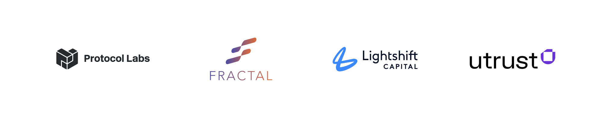
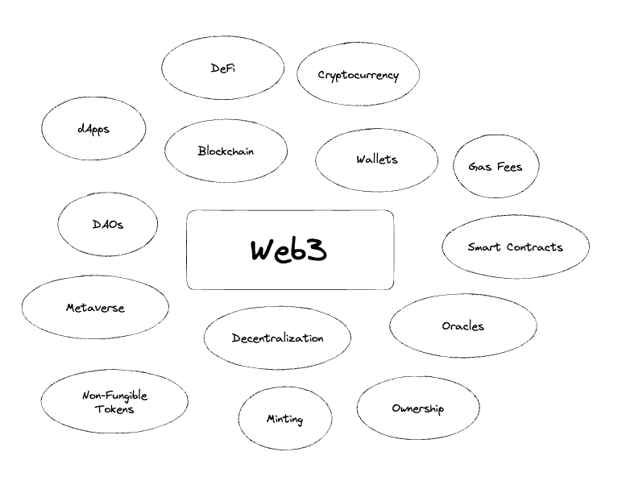
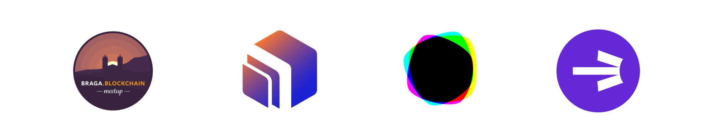
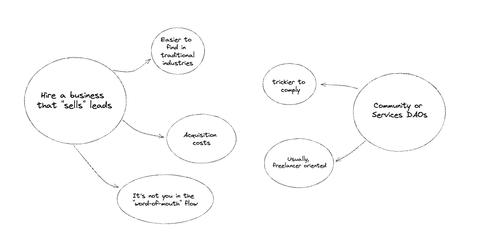

### Join the Subvisual Hub3: a collaborative hub that creates Web3 business opportunities.

We've been connecting our partners with talented builders for a long time. It proved that it's possible, through collaboration, to build a platform matching qualified builders and agencies with top-notch web3 companies.

That's why, today, we announce Subvisual's Hub3. The platform you can join to connect with incredible opportunities on Web3.

Are you interested? 📄 Fill out this [form](https://forms.gle/Sit15GZGkHwTqt6h9) if you want to be part of this project.

### Take the leap from web2 to web3 with us

We aim to become one of the industry's trusted sources of web3 product agencies, building top-notch products and companies together.

Our mission is to turn web2 product agencies into web3 trusted builders - one company at a time. We've done that ourselves, and we're ready to help others build that road.

### What's in it for you?

Hub 3 contributors:

* Help each other build web3 skills and network by regularly sharing knowledge on the Hub's communication platforms;
* Connect with some of the web3 household names and most exciting startups;
* We promise infinite value-added, with no costs except your invested time (which will compound);
* We can help each other thrive in these financially challenging times by sharing projects that could benefit from your extra knowledge.

Ecosystem partners and customers:

* We ensure all the companies in the Hub have a trustworthy track record in product-building and the web3 knowledge level is clearly stated;
* Hub3 will help you save time and money by sharing what you need with all the relevant companies, almost with no effort;
* We'll help you focus on your product or business core needs while handling your outsourcing challenges to talent with decades of experience building all sorts of digital products and services.

### Why?

You may wonder why we are doing this. As a company that has done consulting work for over a decade, we know how much agencies and freelancers can impact the space. And Web3 needs more builders.

At Subvisual, we've always believed in the power of empowering people, companies, and communities. That's what got us together in the first place and what keeps us going after so many years in this space.

For the last 10 years, we have been building a network of incredibly diverse talent: from top-notch builders and software companies; to exciting founders, teams, and successful VCs, that we helped connect and grow.

### The state of web3

Web3 is a term that comprises many concepts, from principles such as governance decentralization or data ownership to more complex disruptive ideas and technologies, such as cryptocurrencies, smart contracts, and blockchain(s).

As with any technological disruption, changing how the internet is used comes with challenges and opportunities. First, let's take a look at a few [market stats](https://metav.rs/blog/web3-market-statistics-2022-2023/):

* Current Web3 market capitalization is estimated at $27.5 billion, and it is expected to grow up to $81.5 billion by 2030, increasing at a compound annual rate of 43.7%;
* Between the first quarter of 2021 and the first quarter of 2022, the growth of blockchain games skyrocketed by 2,000%, and it is expected that ~46% of finance apps already take advantage of Web3 technologies;
* The Metaverse market alone is already experiencing an annual expansion rate of 13.1%, while NFTs are said to have generated more than $40 billion in cryptocurrency sales;

Not surprisingly, the need for competent product builders, incredibly when familiar with web3 technologies and vision, is also rising, following the market growth and companies' urge to shape their products for the next generation of the internet.

### Hard to find good, trustworthy builders

In a recent [Forbes](https://www.forbes.com/sites/ninabambysheva/2022/08/29/web3-growth-stymied-by-scarcity-of-programmers/?sh=21485fc7fa49) article, companies like [Protocol Labs](https://protocol.ai/) or [Ava Labs](https://www.avalabs.org/) state that "there is a shortage of developers who are able to think about what the next generation of internet will look like", especially when considering how fast the space is growing and "what developers are doing today may not be what we need them to do six months from now".

On the other hand, with recent market crashes such as the [FTX collapse](https://www.investopedia.com/what-went-wrong-with-ftx-6828447) or constant [rug pulls](https://www.soliduslabs.com/reports/rug-pull-report), the overall trust levels in the industry, including those looking for a job in tech, are also affected. According to the latest research calculations published by [Immunefi](https://venturebeat.com/security/web3-crypto-fraud/), one of the leading bug bounty providers in Web3, almost $4 billion in crypto funds were lost to hacks and scams in 2022.

By putting ourselves in an investor's or founder's shoes, quality and trust are precious assets when doing business - now more than ever. That's where, most of the time, product agencies and "dev shops" come up with a solution, especially if:

* We keep a track record of happy customers;
* We push innovation and dig into new technologies, following the market's predictions and opportunities;
* We know what businesses look like. We've met hundreds of founders and teams across the last 10 years, and we are ready to adapt and explore new ideas and projects.

But that's not enough. We need to be known. And there's no better way to have a strong presence in the space than having the best people to back you up.

### Growing a web3 network

It sure is challenging, but it is getting increasingly more accessible than other networks because most of it is decentralized, community-governed, and oriented. This means: you can be anywhere worldwide and still make excellent connections.

Projects like [Developer DAO](https://www.developerdao.com/) or the thousands of token-gated Discord or Telegram connections facilitate access to the industry by allowing you to learn by performing a simple task or owning an NFT, for starters. After completing onboarding, it is primarily up to you to build your reputation "on-chain".

Also, web3 events are happening all over the globe, with hackathons and conferences being unforgettable moments to understand what everyone is up to and what challenges are facing. Events like last year's [Devcon](https://blog.ethereum.org/en/2022/11/17/devcon-vi-wrap) in Bogotá, Colombia, where 6000 web3 builders and enthusiasts attended, are a great example. Plus, [anyone can vote on where the next one will happen](https://blog.ethereum.org/en/2022/11/17/devcon-vi-wrap)!

Over the years, at Subvisual, we have been focusing more on building communities. Locally, by founding and supporting projects like [BragaBlockchain](https://twitter.com/bragablockchain) or [CoimbraBlockchain](https://twitter.com/Coimblockchain); or by helping to build big community DAOs, such as [DeNites](https://www.notion.so/Braga-Blockchain-9af411daa9a84ec79bcff9f77eeb5127) and [Activate](https://twitter.com/activate_build), we're connecting to thousands of like-minded innovators that share the same mission of taking meaningful ideas out of paper.

### Maintaining a healthy runway

However, one of the issues that affect the innovation speed of consulting companies can be market fluctuations. During the last year, associated with the crypto markets slowing down, we've seen companies reducing their investment in new products and focusing more on internal work. That has and will inevitably keep impacting consulting agencies' business.

That's why we believe that we need to cooperate: to build more opportunities, to share knowledge, and to empower each other, rather than to fight for the same spaces. There is always space for quality work; we must work together to find the right road to success.

**Here's our take on how this kind of collaboration should work:**

* We're actively vouching for innovation and focusing on contributing to web3 technologies, but there is much more out there that needs to be done, so we shouldn't focus solely on finding web3 projects and opportunities;
* What doesn't work for someone can be a fantastic opportunity for someone else: share always. Opinions should be asked before stated;
* We don't believe finder's fees are a suitable incentive mechanism for collaboration between agencies, so we don't want to use it. Rewarding the act of finding projects to be explored by others removes focus from what agencies need to be worried about: delivering great products. We encourage pure collaboration: "here's an opportunity to join a project I need help with. Tell me your price and let's find a way to work together".

### Existing alternatives

Let's look at the existing alternatives to build networks or find more valuable leads. It's important to note that there is no exclusivity on anything we are proposing here: try them all, see for yourself, and choose the one(s) you believe can bring you better results. DYOR: "do your own research".

On the one hand, Community or Services DAOs are an excellent way to build a network, but, a lot of times, it can become trickier to find deals for agencies. There are still a lot of hindrances to legally assigning contracts and invoicing someone through a DAO. Companies that look at DAOs usually plan to work with freelancers or more legally flexible entities than most agencies. At Subvisual, we encourage our team members to participate in DAOs, and they often bring us exciting opportunities while finding their own.

Another classic option is to hire businesses that "sell" leads. It's a model that has been working for ages for many people and might work in web3 too. However, it can add costs that don't necessarily add value. Also, it needs to be clarified if you'll be growing your business: it's not you on the word-of-mouth flow. It's the person you contracted to get projects for you. We've used such services in the past, but we have consistently concluded that fostering a collaborative network is better. Like the alternative we are here to build - with you.

### How can you join?

We're openly collecting interest through [this form](https://forms.gle/Sit15GZGkHwTqt6h9).

💡 **Let's build together?** We'd love to know what you think about the Hub3. Forward all your ideas, opinions, and suggestions to [contact@subvisual.com](mailto:contact@subvisual.com).