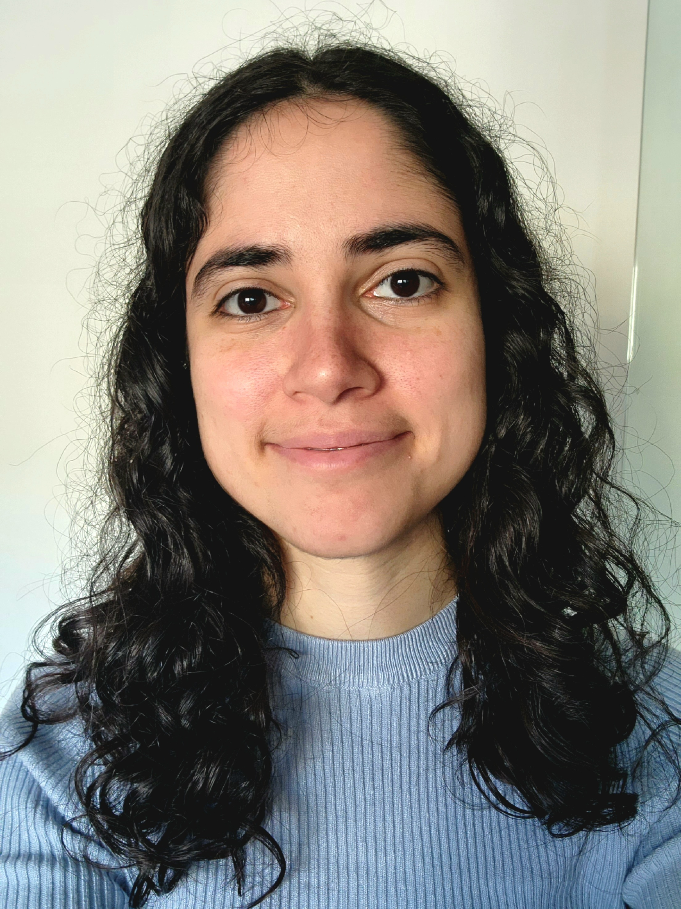
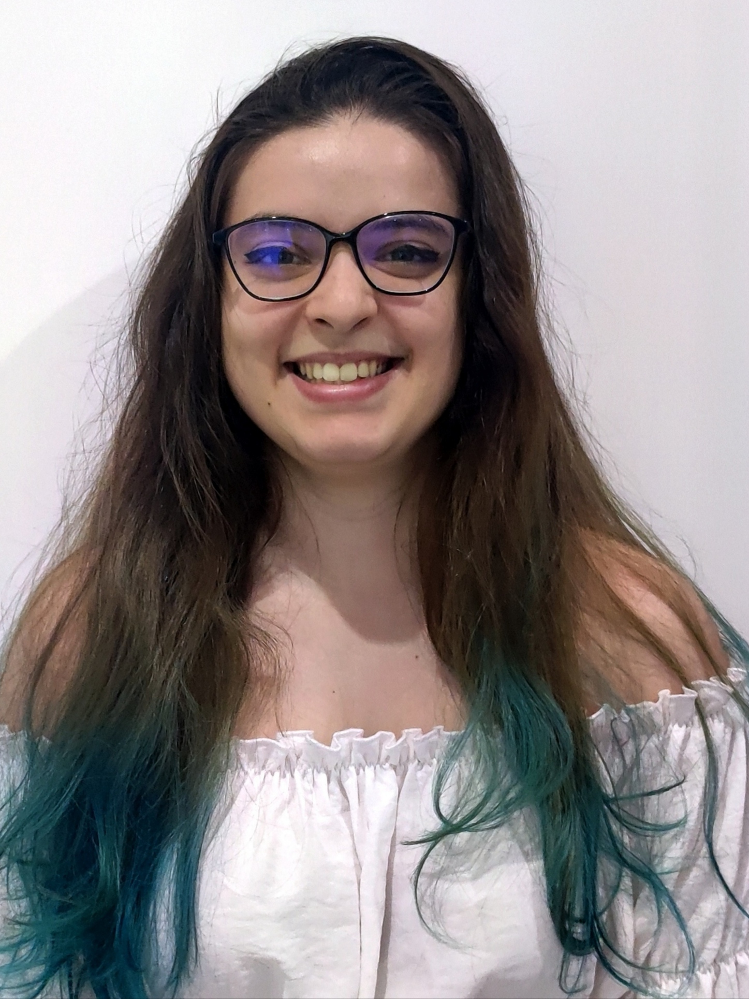

Summer Camp 2023 has come to an end. Before we say goodbye, we want to share a personal message from the Summer Camp 2023 team with everyone!

Masha, do you want to go first? 

Sure! I enjoyed the program a lot, I believe it was exactly what I needed to make sure that I chose my next profession well. As for a foreigner, it may be hard to find yourself in a new country, learn the language, make friends, and get a job. I was lucky to become a part of such a friendly community, even for only 10 weeks. I found a lot of inspiration in people of the Subvisual Universe.

It was cool to actually work in a team, communicate every day, and resolve issues. And even though we worked on a “toy” project", sometimes it felt so real: we were coming to the office and talking to actual specialists as if we were real colleagues discussing a real project with real goals and tough deadlines. After such a cool “demo” of a Product Manager’s job, I am looking forward to finally getting a real one. I’m grateful for this opportunity to make my first step on a long and exciting way.

And now, I pass the floor to Tiago.

I joined this experience with the goal of improving and learning a lot about programming. I'm glad to say I achieved my objective. In these 10 weeks, I feel like I absorbed a tremendous amount of knowledge – probably the maximum possible within this time frame. The mentors played a significant role, helping with their vast experience to guide us, often propelling us forward. Their input was invaluable compared to trying to navigate everything on our own.

Through this journey, I've gained a sense of confidence in tackling challenges. I can now at least conceptualize how to approach and solve problems that come my way.

Our team dynamics were fantastic. While we weren't always perfectly synchronized, we had a great way of addressing issues by communicating openly. It's amazing how many problems can be resolved through discussion. 

Overall, this experience has been incredible. It's been a rewarding and enjoyable way to spend my summer.

Natália, do you want to go next?

Of course.

I came to the program with the idea I would be able to experiment a bit of everything. Since I was always very indecisive when it came to my career, I ended up liking everything and didn’t know what to follow next. I don’t need to say that I couldn’t experiment everything like I thought I would, but I learned so much with the experience that I can definitely say it was the best decision I made this summer. There was always so much to learn in my role that sometimes it was overwhelming but extremely rewarding.

To have the opportunity to work on a team where all members were super motivated and eager to learn made me realize that nothing can be accomplished by just one person, and there’s always so much to learn, and everything can change from one hour to the other, so the ability to adapt with the changes proved to be one of the most important I learned so far.

I wanted to improve my technical skills and experiment the role of a product designer. I had never done such a big project before, so it was definitely a challenge and I learned a lot, not only technical skills but also soft skills. Communication and the ability to convey ideas in a simple and clear way are extremely important.

I’m leaving the summer camp with a bittersweet feeling. Even though I’m feeling sad that it is over, I loved the experience and loved working with my team. Everyone in the Universe was so caring and helpful. I feel this experience allowed me to grow as a person and as a professional, finally being able to step out of my comfort zone of personal projects and try to learn new things without fear.

And last but not least, Jess, the floor is yours.

There are so many things about this experience that I’d like to say that I don’t even know where to begin. 

When I decided to apply to summer camp, I felt it would be a life-changing experience for me if I had the chance to participate. I was not wrong; it really helped me to evolve and changed me in so many ways.

The first weeks were overwhelming because everything was new, from working in a company in a real project with an actual team to the technical part of working in web dev with lots of new tools. At first, it was very challenging, but then it was so rewarding to look back and see all I had accomplished.

It helped me to understand better the things I like to do most, to discover that I like web development, and to explore front-end development.

The cherry on top of the cake was, without a doubt, my amazing team. Without them, it wouldn’t have been the same. I was so lucky, I couldn’t ask for a better team. Every single one of them was approachable, helpful, available, and kind all the time. We did a really great job working together. 

Applying for this program was the best decision I made this summer, and I’m very proud of the final outcome. I can only be very happy and thankful. I now feel more comfortable programming and working in general. 

Just the fact that I grew much more confident in my professional self made this experience more than worth it, and I know that I will look back and always remember it with a huge smile on my face.

For everything, I have to thank you all, people of the Universe, who were so helpful and kind since day one.

Once again, We thank you, Subvisual Group, for this amazing journey in the Universe and we hope you liked it as much as we did. 💙 🪐