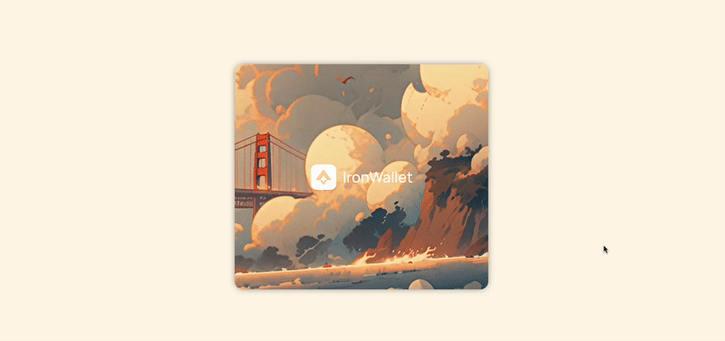

A common way of adding some life to a UI is through movement, especially when that movement is based on user actions. Let's take a look at how that's achieved in this demo: 

https://device-orientation-demo.vercel.app ([Github](https://github.com/davelange/device-orientation-demo))



What's happening under the hood here? Basically we track the mouse position (for desktop) and device orientation (for mobile), and based on the provided values we shift and rotate an image.

Let's start with device orientation.

## Device orientation

[Device orientation events](https://developer.mozilla.org/en-US/docs/Web/API/Window/deviceorientation_event) use the gyroscope to provide data regarding orientation - such as how a smartphone might be tilted or turned one way or another.

We are given 3 values, describing 3 types of rotation: alpha, beta and gamma. This may sound odd, and I really recommend [this section of the documentation](https://developer.mozilla.org/en-US/docs/Web/API/Device_orientation_events/Orientation_and_motion_data_explained#device_coordinate_frame) to understand what they mean. In summary, assuming your smartphone is lying face up on a desk in front of you:

* Gamma is the z axis: turning your phone from side to side.
* Beta is the x axis: tilting forwards and backwards.
* Alpha is the y axis: turning your phone round, always remaining face up.

A couple of things to be aware of: 

* On iOS, access to motion and orientation events is off by default. To gain access, you need the `requestPermission` method.
* Chromium browsers seem to disable this event on `http` connections. This means `localhost` development must take place on Firefox! 

Also, this event picks up even the slightest movements, so I recommend using some throttling. 

For our demo we only really need the gamma rotation, as our movement is only horizontal. We could do something like this:

```ts
function handleOrientationEvent(event: DeviceOrientationEvent) {
    const { gamma } = event;

    if (gamma === null || exceedsSomeLimit(gamma)) {
      return;
    }

    setGamma(gamma);
}

window.addEventListener("deviceorientation", handleOrientationEvent);
```

```tsx

```

Note that the event listener has to be attached specifically to the `window`. 

As the gamma rotation is `0` when the device is "centered", this will shift the image left or right when you turn your device either way.

In reality, you probably want to process the gamma value into some other value rather than use it directly in the CSS, but the basic idea is the same. 

## Using the mouse position

We can use the `clientX` value on the `mousemove` event to track the mouse position. Unlike the device orientation though, `0` means the left edge of the screen, not the middle. This means we need to work out the current position in relation to the center of the screen:

```ts
function handleMouseMove(event: MouseEvent) {
    const middle = window.innerWidth / 2;
    const diff = middle - event.clientX;
    

    if (exceedsSomeLimit(diff)) {
      return;
    }

    setMouseX(diff);
}

document.addEventListener("mousemove", handleMouseMove);
```

```tsx

```

This gives you a basic idea of how to use the events' data, but how exactly are we transforming the image?

## Perspective in CSS

There are 2 transforms being applied to the image: `translateX` and `rotateY`. The x translation is pretty obvious - we want to move the image left or right. 

But you might have noticed the image also has a perspective effect, making one end of the image look further away then the other. We create this through a combination of [`perspective`](https://developer.mozilla.org/en-US/docs/Web/CSS/perspective) and `rotateY`. The `perspective` property is crucial here for the 3D effect. You can check out how these properties interact here:

<iframe height="500.03125" style="width: 100%;" scrolling="no" title="Perspective demo" src="https://codepen.io/davelange_/embed/zYexYmJ?default-tab=result" frameborder="no" loading="lazy" allowtransparency="true" allowfullscreen="true">
  See the Pen <a href="https://codepen.io/davelange_/pen/zYexYmJ">
  Perspective demo</a> by David Lange (<a href="https://codepen.io/davelange_">@davelange_</a>)
  on <a href="https://codepen.io">CodePen</a>.
</iframe>

As you can see, if we disable the perspective, the rotation on the Y axis is flat.

## Putting it all together

By combining these properties, we can already get some pretty interesting visual results. You could even create some parallax by having different images/planes move at different speeds.

One thing that's missing is transforming the event values into numbers that make sense for our CSS. This really depends on the intended effect and on the size of the image and HTML elements, so I suggest experimenting a bit to find out what works best for you!

For this demo I wanted the image to move quickly while it's more central, and slow down when it reaches the edges of its rotation - this means easing the transformation. Basically, if you know:

* the max transformation that you want to apply (eg: `15deg rotation`)
* the max event position that you want to consider (eg: `340 mouseX` or `40deg gamma`)
* the current event position

Then you can ease the transformation value being applied based on where the current position is from `0 - max event position`. It looks something like this:

```ts
function getEasedValue({
  maxPosition,
  maxOutput,
  currentPosition,
}: {
  maxPosition: number;
  maxOutput: number;
  currentPosition: number;
}) {
  let positionProgress = (Math.abs(currentPosition) * 100) / maxPosition / 100;
  let eased = easeOutQuint(positionProgress) * maxOutput;

  return eased * Math.sign(currentPosition);
}


// The easing function. Source: https://easings.net/
function easeOutQuint(x: number): number {
  return 1 - Math.pow(1 - x, 5);
}

function transformsFromOrientation({
  gamma,
  mouseX,
}: {
  gamma: number | undefined;
  mouseX: number | undefined;
}) {
  // For device orientation values
  if (gamma !== undefined) {
    const translateX = getEasedValue({
      maxOutput: 7,
      maxPosition: 40,
      currentPosition: gamma,
    });
    const rotateY = getEasedValue({
      maxOutput: 7.8,
      maxPosition: 40,
      currentPosition: gamma,
    });

    return {
      translateX,
      rotateY: rotateY * -1,
    };
  }

  // For mousemove values  
  if (mouseX !== undefined) {
    const translateX = getEasedValue({
      maxOutput: 15,
      maxPosition: 300,
      currentPosition: mouseX,
    });
    const rotateY = getEasedValue({
      maxOutput: 3.55,
      maxPosition: 300,
      currentPosition: mouseX,
    });

    return {
      translateX: translateX,
      rotateY: rotateY * -1,
    };
  }

  return {
    translateX: 0,
    rotateY: 0,
  };
};
```

Then in your component you can use it for either the mouse or orientation:

```ts
const { translateX, rotateY } = transformsFromOrientation({ gamma, mouseX });

...


```

You can find the full code in [the demo repo](https://github.com/davelange/device-orientation-demo), both for React and Svelte.

## Wrapping up

These are just some of the many ways to subtly add some life and movement to your UI. CSS transforms, along with properties like filter and opacity, are a powerful tool. Just remember not to take things too far. You don't want to make your users feel seasick. 🙂